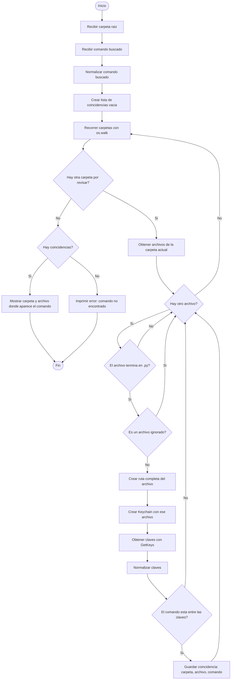
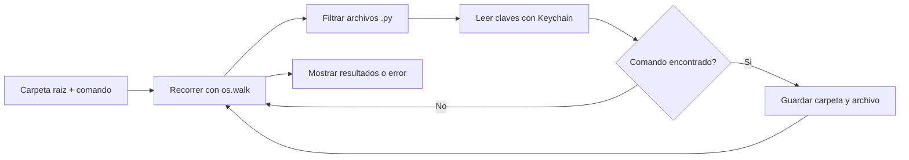

# Diagrama de Flujo: Buscar En Que Carpeta Esta Un Comando

Este documento describe como podria hacerse un programa en Python que use `os` y `Keychain` para recorrer un directorio de diccionarios y averiguar en que carpeta aparece un comando especifico.

La idea es partir de una carpeta base, por ejemplo:

```text
ejemplo de diccionario terminado/
```

y buscar un comando, por ejemplo:

```text
guardar
```

El programa debe revisar los archivos `.py` de cada carpeta, extraer sus claves con `Keychain` y decir donde encontro el comando.

## Objetivo

El programa debe:

1. Recibir una carpeta raiz.
2. Recibir el comando que se quiere buscar.
3. Recorrer la carpeta raiz y sus subcarpetas.
4. Detectar archivos `.py` que puedan contener diccionarios.
5. Usar `Keychain` para extraer las claves de esos archivos.
6. Comparar las claves con el comando buscado.
7. Informar en que carpeta y archivo aparece el comando.
8. Si no aparece en ningun lado, imprimir error.

## Diagrama de Flujo



## Version Resumida



## Criterio Para Revisar Archivos

El programa puede revisar todos los `.py`, o puede ignorar archivos auxiliares.

Una regla posible:

```text
Revisar archivos .py
Ignorar __init__.py
Opcionalmente ignorar ayuda.py
Opcionalmente ignorar archivos de traduccion si solo se buscan comandos base
```

Si se quiere buscar tambien comandos de voz traducidos, entonces conviene revisar tambien:

```text
TraduceToEs.py
TraduceToEn.py
TraduceToPT.py
```

Si se quiere buscar solo comandos base, conviene ignorarlos.

## Pseudocodigo En Python

```python
import os
from Keychain import Keychain


def normalizar(texto):
    texto = texto.strip()
    texto = texto.lower()
    return texto


def debe_ignorar_archivo(nombre_archivo, incluir_traducciones=True):
    if not nombre_archivo.endswith(".py"):
        return True

    if nombre_archivo == "__init__.py":
        return True

    if nombre_archivo == "ayuda.py":
        return True

    if not incluir_traducciones:
        if nombre_archivo.startswith("TraduceTo"):
            return True
        if nombre_archivo.startswith("TranslateTo"):
            return True

    return False


def buscar_comando_en_dic(carpeta_raiz, comando_buscado, incluir_traducciones=True):
    comando_buscado = normalizar(comando_buscado)
    coincidencias = []

    for carpeta_actual, subcarpetas, archivos in os.walk(carpeta_raiz):
        for nombre_archivo in archivos:
            if debe_ignorar_archivo(nombre_archivo, incluir_traducciones):
                continue

            ruta_archivo = os.path.join(carpeta_actual, nombre_archivo)

            try:
                keychain = Keychain(ruta_archivo)
                claves = keychain.GetKeys()
            except ValueError:
                continue
            except OSError:
                continue

            claves_normalizadas = [normalizar(clave) for clave in claves]

            if comando_buscado in claves_normalizadas:
                coincidencias.append({
                    "carpeta": carpeta_actual,
                    "archivo": nombre_archivo,
                    "comando": comando_buscado,
                })

    return coincidencias
```

## Ejemplo De Uso

```python
carpeta = "ejemplo de diccionario terminado"
comando = "guardar"

resultados = buscar_comando_en_dic(
    carpeta_raiz=carpeta,
    comando_buscado=comando,
    incluir_traducciones=True,
)

if resultados:
    for resultado in resultados:
        print("Comando encontrado")
        print("Carpeta:", resultado["carpeta"])
        print("Archivo:", resultado["archivo"])
        print("Comando:", resultado["comando"])
else:
    print("Error: comando no encontrado")
```

## Ejemplo De Resultado Esperado

Si se busca:

```text
guardar
```

y se revisan traducciones, podria encontrarse en:

```text
ejemplo de diccionario terminado/file/TraduceToEs.py
```

porque ese archivo contiene una clave similar a:

```python
'guardar': lambda: Gui.runCommand('Std_Save', 0)
```

Si se busca:

```text
save
```

podria encontrarse en:

```text
ejemplo de diccionario terminado/file/file.py
```

porque ese archivo contiene:

```python
'save': lambda: Gui.runCommand('Std_Save', 0)
```

## Variante: Buscar Solo En Archivos Base

Si se quiere buscar solamente comandos base y no comandos traducidos:

```python
resultados = buscar_comando_en_dic(
    carpeta_raiz="ejemplo de diccionario terminado",
    comando_buscado="save",
    incluir_traducciones=False,
)
```

Con `incluir_traducciones=False`, el programa ignora archivos como:

```text
TraduceToEs.py
TraduceToEn.py
TraduceToPT.py
```

Esto sirve cuando se quiere saber donde esta definido el comando original, no sus sinonimos o traducciones.

## Variante: Mostrar Ruta Relativa

Para que el resultado sea mas facil de leer, se puede guardar la ruta relativa respecto de la carpeta raiz:

```python
ruta_relativa = os.path.relpath(carpeta_actual, carpeta_raiz)
```

Entonces, en lugar de mostrar una ruta completa, se podria mostrar:

```text
file/TraduceToEs.py
```

o:

```text
file/file.py
```

## Pseudocodigo Con Ruta Relativa

```python
def buscar_comando_en_dic(carpeta_raiz, comando_buscado, incluir_traducciones=True):
    comando_buscado = normalizar(comando_buscado)
    coincidencias = []

    for carpeta_actual, subcarpetas, archivos in os.walk(carpeta_raiz):
        for nombre_archivo in archivos:
            if debe_ignorar_archivo(nombre_archivo, incluir_traducciones):
                continue

            ruta_archivo = os.path.join(carpeta_actual, nombre_archivo)

            try:
                keychain = Keychain(ruta_archivo)
                claves = keychain.GetKeys()
            except Exception:
                continue

            for clave in claves:
                if normalizar(clave) == comando_buscado:
                    coincidencias.append({
                        "carpeta": os.path.relpath(carpeta_actual, carpeta_raiz),
                        "archivo": nombre_archivo,
                        "clave_original": clave,
                    })

    return coincidencias
```

## Resumen Del Funcionamiento

El programa usa dos herramientas principales:

| Herramienta | Funcion |
| --- | --- |
| `os.walk` | Recorre la carpeta raiz y todas sus subcarpetas |
| `Keychain` | Extrae las claves de cada diccionario `.py` |

La busqueda funciona asi:

1. Se entra a cada carpeta.
2. Se revisan sus archivos `.py`.
3. Se descartan archivos que no interesan.
4. Se extraen claves con `Keychain`.
5. Se compara cada clave con el comando buscado.
6. Se guardan las coincidencias.
7. Al final se muestran los resultados o un mensaje de error.
