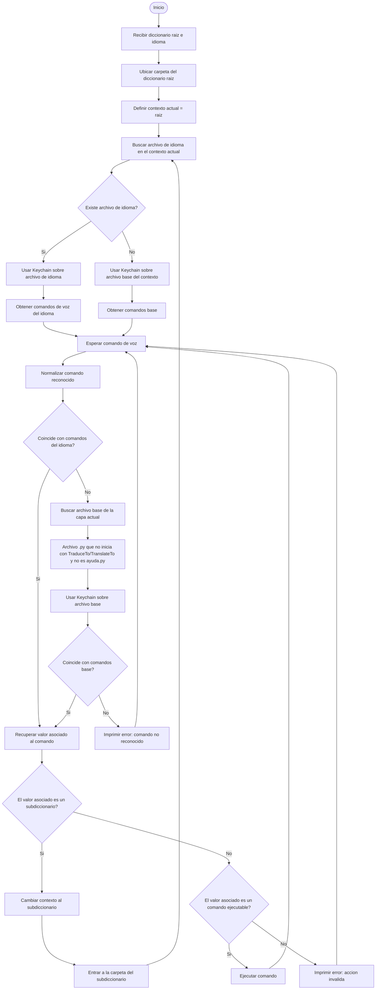
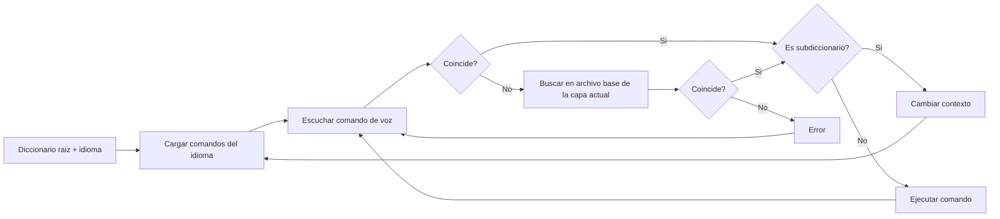

# Diagrama de Flujo: Programa con `Keychain` y Diccionario de Comandos

Este diagrama describe como podria funcionar un programa que use `Keychain.py` junto con un diccionario como `ejemplo de diccionario terminado`.

El objetivo es:

1. Recibir un diccionario raiz, por ejemplo `explorer.py`.
2. Recibir un idioma, por ejemplo espanol.
3. Recuperar los comandos de voz disponibles para ese idioma.
4. Cambiar de contexto si el comando reconocido apunta a un subdiccionario.
5. Si no hay coincidencia en el archivo de traduccion, buscar en el archivo `.py` base de esa misma capa.
6. Si no hay coincidencia en ningun lado, imprimir error.

## Diagrama Principal



## Version Resumida del Flujo



## Explicacion Paso a Paso

### 1. Entrada del programa

El programa recibe dos datos iniciales:

```text
diccionario raiz = explorer.py
idioma = espanol
```

Con esos datos se ubica la carpeta donde esta el diccionario principal:

```text
ejemplo de diccionario terminado/
```

El contexto inicial pasa a ser `explorer`.

### 2. Carga de comandos por idioma

Si el idioma elegido es espanol, el programa deberia buscar un archivo de traduccion como:

```text
TraduceToEs.py
```

Tambien podria contemplar variantes de nombre, por ejemplo:

```text
TranslateToEs.py
TraduceToES.py
```

Una vez encontrado el archivo, se usa `Keychain` para recuperar sus claves.

Ejemplo:

```python
keychain = Keychain("TraduceToEs.py")
comandos_voz = keychain.GetKeys()
```

Eso permite obtener comandos de voz como:

```text
Archivo
editar
imprimir
refrescar
foto
ayuda
```

Estos son los comandos aceptados en el contexto actual.

### 3. Reconocimiento del comando

El programa espera una entrada de voz ya convertida a texto:

```text
"archivo"
```

Antes de comparar, conviene normalizar el texto:

```text
Archivo -> archivo
 archivo  -> archivo
```

La normalizacion puede incluir:

1. Pasar a minusculas.
2. Quitar espacios al inicio y al final.
3. Opcionalmente quitar tildes.
4. Unificar multiples espacios.

### 4. Coincidencia con comandos del idioma

El programa compara el texto reconocido con las claves del archivo de idioma.

Si coincide, recupera el valor asociado.

Ejemplo conceptual:

```python
'Archivo': file
```

En ese caso, `Archivo` apunta al subdiccionario `file`.

### 5. Si coincide con un subdiccionario

Si el comando reconocido apunta a un diccionario y no a una accion final, el programa debe cambiar de contexto.

Ejemplo:

```text
contexto actual = explorer
comando reconocido = archivo
valor asociado = file
```

Entonces el nuevo contexto pasa a ser:

```text
contexto actual = file
```

El programa entra a:

```text
ejemplo de diccionario terminado/file/
```

Y vuelve a cargar los comandos aceptados para ese contexto.

Para espanol, buscaria:

```text
file/TraduceToEs.py
```

Ahora los comandos aceptados podrian ser:

```text
nuevo
abrir
cerrar
guardar
salvar
guardar como
salvar como
ayuda
```

Esto cumple la condicion B: cuando se entra a un subdiccionario, cambian los comandos que acepta el programa.

### 6. Si no coincide con el archivo de idioma

Si el comando no aparece en el archivo de traduccion, el programa debe buscar en el archivo base de esa misma capa.

El archivo base es el `.py` principal del contexto, excluyendo:

```text
TraduceTo...
TranslateTo...
ayuda.py
```

Por ejemplo, en la raiz:

```text
explorer.py
```

En la carpeta `file`:

```text
file.py
```

En la carpeta `edit`:

```text
edit.py
```

En la carpeta `print`:

```text
print_cmds.py
```

El programa vuelve a usar `Keychain`:

```python
keychain_base = Keychain("explorer.py")
comandos_base = keychain_base.GetKeys()
```

Si el usuario dijo `file`, aunque no haya usado la traduccion `Archivo`, igual podria coincidir con el comando base.

Esto cumple la condicion C.

### 7. Si coincide con el archivo base

Si el comando coincide con una clave del archivo base, se aplica la misma decision:

```text
Es subdiccionario? -> cambiar contexto
Es comando final? -> ejecutar
```

Ejemplo:

```text
comando reconocido = screenshot
```

En `explorer.py` existe:

```python
'screenshot': lambda: Gui.runCommand('Std_ViewScreenShot', 0)
```

Entonces el programa ejecuta la captura de pantalla.

### 8. Si no coincide con nada

Si no coincide con:

1. El archivo de idioma.
2. El archivo base de la capa actual.

Entonces el programa imprime error:

```text
Error: comando no reconocido
```

Esto cumple la condicion D.

## Pseudocodigo

```python
def ejecutar_programa(diccionario_raiz, idioma):
    contexto = crear_contexto(diccionario_raiz)

    while True:
        comandos_idioma = cargar_comandos_idioma(contexto, idioma)
        comandos_base = cargar_comandos_base(contexto)

        comando = escuchar_comando()
        comando = normalizar(comando)

        resultado = buscar(comando, comandos_idioma)

        if resultado is None:
            resultado = buscar(comando, comandos_base)

        if resultado is None:
            print("Error: comando no reconocido")
            continue

        if es_subdiccionario(resultado):
            contexto = cambiar_a_subdiccionario(contexto, resultado)
            continue

        if es_comando_ejecutable(resultado):
            resultado()
            continue

        print("Error: accion invalida")
```

## Regla Para Encontrar El Archivo Base

Dentro de cada carpeta, el archivo base puede detectarse asi:

```text
Tomar archivos .py
Descartar archivos que empiecen con TraduceTo
Descartar archivos que empiecen con TranslateTo
Descartar ayuda.py
El archivo restante es el diccionario base de esa capa
```

Ejemplo en la raiz:

```text
explorer.py        <- archivo base
ayuda.py           <- se descarta
TraduceToEs.py     <- se descarta
TraduceToEn.py     <- se descarta
TraduceToPT.py     <- se descarta
```

Ejemplo en `file/`:

```text
file.py            <- archivo base
ayuda.py           <- se descarta
TraduceToEs.py     <- se descarta
TraduceToEn.py     <- se descarta
TraduceToPT.py     <- se descarta
```

## Resultado Esperado

Con este flujo, el programa puede:

1. Arrancar desde `explorer.py`.
2. Cargar comandos de voz en espanol desde `TraduceToEs.py`.
3. Entrar a subdiccionarios como `file`, `edit`, `print` o `doc`.
4. Cambiar dinamicamente los comandos aceptados segun el contexto.
5. Buscar comandos base si no hay coincidencia con la traduccion.
6. Informar error si el comando no existe en ningun nivel valido.
