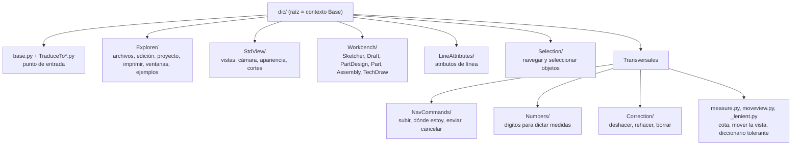
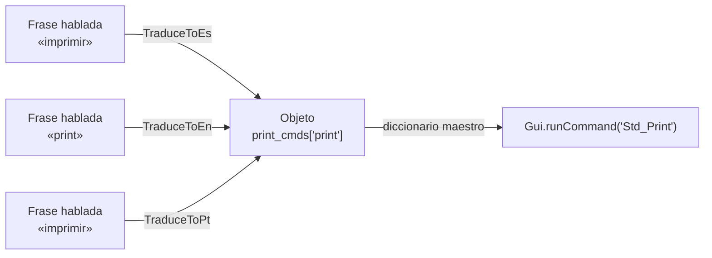
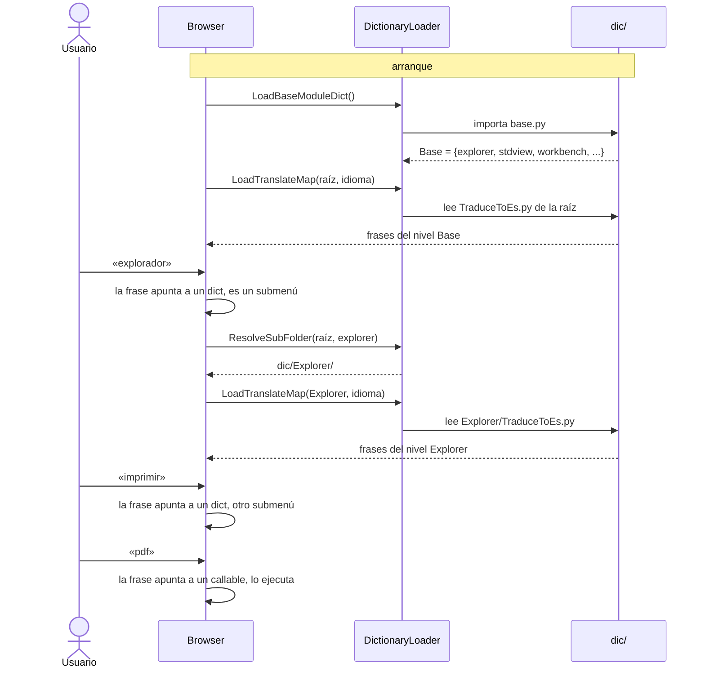

# DAV — `Dav/dic/`: el árbol de comandos por voz

> Proyecto DAV · UADER - FCyT. Este archivo explica **qué hay en `dic/` y cómo está
> organizado**. Para *agregar* cosas, ver la [guía de desarrollo](../docs/guia-desarrollo-dav.md).

---

## Qué es

`Dav/dic/` contiene **todo lo que el usuario puede decir**. Es un árbol de carpetas:
cada carpeta es **un nivel de contexto** (lo que el usuario "tiene delante" en un
momento dado) y sus archivos dicen qué comandos hay ahí y con qué palabras se llaman.

No tiene lógica de reconocimiento ni de navegación. Eso lo hace el `Browser`
(`Dav/scr/ComponentesDAV/IntegracionGUI/GUIFreeCad/navigation/browser.py`) con el
`DictionaryLoader`, que **leen** este árbol. Sumar un comando es editar `dic/`, no el
motor.

Tiene más de 800 archivos Python, unos 500 íconos SVG y cerca de 130 carpetas.

---

## Mapa del árbol



| Carpeta | Contenido | Se entra diciendo |
| --- | --- | --- |
| `Explorer/` | `File`, `Proyecto`, `Edit`, `Print`, `Windows`, `Expressions`, `Tools`, `StructureToolbar`, `Examples` | «explorador», «archivo»… |
| `StdView/` | `StandardViews`, `Camera`, `Appearance`, `Clipping`, `DrawStyles`, `Material`, `Overlay`, `Panels`, `SavedViews`, `Stereo`, `Toolbars`, `Tree`, `Visibility` | «vista estándar» |
| `Workbench/` | `Sketcher`, `DraftWork`, `PartDesign`, `Part`, `Assembly`, `TechDraw` (cada uno con muchos subniveles) | «mesa de trabajo» |
| `LineAttributes/` | `attributes` | «atributos de línea» |
| `Selection/` | Siguiente, anterior, seleccionar todo, deseleccionar, objeto actual, cantidad, borrar | «selección» |

Las carpetas transversales **no son un submenú**: sus comandos valen en cualquier lugar
del árbol o son utilidades que usa el resto.

| Carpeta o archivo | Rol |
| --- | --- |
| `NavCommands/` | Las palabras que mueven el propio `Browser`: **subir un nivel**, **dónde estoy**, **enviar** (cierra la frase) y **cancelar**. Viven acá, y no en el código, para poder agregar sinónimos sin tocar `browser.py`. `NavActions.py` define los valores centinela |
| `Numbers/` | Palabras de dígitos para dictar medidas y su gramática de Vosk (`get_numeric_grammar_phrases`) |
| `Correction/` | `undo`, `redo`, borrar el último objeto, borrar uno elegido, limpiar los rotos. Borrar siempre confirma por voz |
| `measure.py` | Cota lineal: pide 4 valores (2D) o 6 (3D) según el documento |
| `moveview.py` | Centra la cámara en un punto dictado, sin cambiar el zoom |
| `_lenient.py` | `LenientDict`: un diccionario que devuelve un comando vacío en vez de `KeyError` para claves aún no implementadas |

---

## Anatomía de una carpeta

Todas las carpetas siguen la misma forma:

```
Explorer/Print/
├── __init__.py          # vacío, hace de paquete
├── Print.py             # diccionario maestro: claves internas → callables
├── ayuda.py             # texto de ayuda del nivel
├── TraduceToEs.py       # frases en español → los mismos callables
├── TraduceToEn.py       # ... en inglés
├── TraduceToPt.py       # ... en portugués (en la raíz se llama TraduceToPT.py)
└── print.svg            # un ícono por clave que tenga botón (la clave 'print' busca print.svg)
```

| Archivo | Qué contiene | Ejemplo |
| --- | --- | --- |
| Diccionario maestro (`<Carpeta>.py`) | Las **claves internas** (una palabra en inglés) y qué ejecuta cada una. Los submenús van como valor de su propia clave | `print_cmds = {'print': ..., 'pdf': ..., 'help': ayuda}` |
| `TraduceTo<Idioma>.py` | Las **frases habladas** de ese idioma. Cada una apunta al mismo objeto del maestro | `'imprimir': print_cmds['print']` |
| `ayuda.py` | Explica los comandos del nivel; el maestro la enlaza como `'help'` | `def ayuda(): ...` |
| `*.svg` | El ícono del botón. Se busca **por el nombre de la clave** | `print` → `print.svg` |
| `_algo.py` | Código de apoyo del nivel (no es un diccionario) | `Proyecto/_project.py` |

### Dos capas separadas a propósito



Las tres traducciones apuntan **al mismo objeto**. Por eso agregar un idioma o un
sinónimo es editar un `TraduceTo*` sin tocar lo que hace el comando, y cambiar lo que
hace un comando es editar el maestro sin tocar ninguna frase.

---

## Cómo lo recorre el motor



Lo que hay que saber de este recorrido:

- **Un valor `dict` es un submenú; un valor callable es un comando.** El `Browser` decide
  así qué hacer con cada frase.
- **Cada nivel lee solo el `TraduceTo*` de su carpeta.** Las frases disponibles en un
  momento son las de ese nivel, más las globales de `NavCommands/`.
- **La carpeta del submenú se encuentra por identidad de objeto**: el `DictionaryLoader`
  busca en las subcarpetas cuál expone el mismo `dict` que apunta la frase, y solo si no
  lo halla la busca por nombre. Por eso el diccionario maestro de una carpeta se llama
  como ella (`Print/Print.py`, `Workbench/workbench.py`).
- **Las frases del nivel actual son la gramática de Vosk.** El reconocedor solo oye las
  palabras del contexto: ver [`acortador-gramatica-vosk.md`](../docs/acortador-gramatica-vosk.md).
- **Un archivo roto no tumba el motor**: si un diccionario falla al importar, el loader
  lo omite y sigue. Lo malo es que **falla en silencio**; ver las reglas.

### El punto de entrada

`base.py` define `Base`, el contexto raíz, y enlaza los módulos de primer nivel:

```python
Base = {
    "explorer":       explorer,        # Explorer/Explorer.py
    "stdview":        StdView,         # StdView/StdView.py
    "workbench":      workbench,       # Workbench/workbench.py
    "lineattributes": LineAttributes,  # LineAttributes/LineAttributes.py
    "selection":      selection,       # Selection/selection.py
    "preferences":    open_preferences,
    "hide_dav_panel": hide_dav_panel,
    "show_dav_panel": show_dav_panel,
}
```

Los `TraduceTo*.py` de la raíz dicen con qué palabras se llega a cada uno y suman los
comandos globales que no son un submenú: `Correction`, la cota (`measure`), abrir las
preferencias y mostrar u ocultar el panel.

---

## Reglas de la casa

| Regla | Por qué |
| --- | --- |
| **Los submenús van anidados bajo su propia clave, nunca aplanados.** `explorer.update({'file': file})`, jamás `explorer.update(file)` | Aplanar pisa en silencio las claves repetidas (`help`, `create`…) y saca a la carpeta del árbol navegable, con lo que su `TraduceTo*` no se lee nunca. Lo verifica `tests/test_real_dictionaries.py`. Ver `pendientes-dav.md` §4 |
| **Las claves internas son una palabra en inglés** y no repiten el contexto del padre | Dentro de `arc/` se dice `center`, no `arc_from_center` |
| **Las frases habladas, en cada idioma, van solo en `TraduceTo*`** | El maestro no conoce idiomas |
| **`TraduceTo*` enlaza por objeto** (`print_cmds['print']`), no duplica funciones | Un solo lugar donde cambiar lo que hace un comando |
| **`ayuda.py` en cada carpeta**, enlazado como `'help'` | Mantiene la ayuda del nivel al día |
| **Un ícono por clave, con su mismo nombre** (`print.svg`) | El panel lo busca por el nombre de la clave. Dos SVG con el mismo nombre en carpetas distintas comparten ícono |
| **Los imports de `dic/` tienen que estar limpios** | Un solo import roto en una hoja profunda puede dejar al `Browser` sin comandos, y no avisa. Ver `pendientes-dav.md` §6 |
| **Un solo punto de comparación de frases** | Se normaliza con `DictionaryLoader.NormalizeSpoken` (sin tildes, minúsculas). Ver `pendientes-dav.md` §7 |
| **Cabezal de licencia en cada archivo nuevo** | Ver `CLAUDE.md` |

---

## Qué ejecuta un comando: tres niveles

El valor de cada clave del diccionario maestro puede ser de tres tipos. Usá el más
simple que alcance.

| Nivel | Cuándo | Ejemplo |
| --- | --- | --- |
| **1. Comando nativo** | Existe un comando de FreeCAD que no abre un diálogo propio | `'front': lambda: Gui.runCommand('Std_ViewFront', 0)` |
| **2. API de Python** | Hace falta pasar valores por voz o el comando nativo abre un diálogo que no se maneja por voz | `'new': lambda: FreeCAD.newDocument()`; o una función propia que pide parámetros |
| **3. API de la vista o de Qt** | No hay comando equivalente | `'zoomin': lambda: Gui.ActiveDocument.ActiveView.zoomIn()` |

Las funciones con **parámetros tipados** (`radius: float`) piden esos valores por voz
solas: ver [`FlujoComandoConParametros`](../docs/diagramas/FlujoComandoConParametros.md).
Los comandos que arman su propia conversación (elegir un plano, abrir un archivo) usan
los diálogos de `Workbench/_prompts.py`: ver
[`agregar-prompt.md`](../docs/desarrollo/agregar-prompt.md).

---

## Ejemplo completo: `Explorer/`

`Explorer` muestra el patrón con submenús anidados y comandos directos a la vez.

```python
# Explorer/Explorer.py
explorer = {}
explorer.update({'file':     file})        # submenú: Explorer/File/
explorer.update({'edit':     edit})        # submenú: Explorer/Edit/
explorer.update({'examples': examples})    # submenú: Explorer/Examples/
explorer.update({
    'refresh': lambda: Gui.runCommand('Std_Refresh', 0),   # comando directo
    'help':    ayuda,
})
```

```python
# Explorer/TraduceToEs.py
TraduceToEs = {
    'archivo':  explorer['file'],      # la frase entra al submenú
    'ejemplos': explorer['examples'],
    'refrescar': explorer['refresh'],  # la frase ejecuta el comando
}
```

Cada submenú tiene su propia carpeta con el mismo esquema, y así hasta las hojas.

---

## Dónde seguir

| Necesito… | Leer |
| --- | --- |
| Agregar una frase o un comando | [`agregar-comando.md`](../docs/desarrollo/agregar-comando.md) |
| Crear una carpeta nueva | [`agregar-submenu.md`](../docs/desarrollo/agregar-submenu.md) |
| Crear o reutilizar un diálogo de voz | [`agregar-prompt.md`](../docs/desarrollo/agregar-prompt.md) |
| Probar sin abrir la interfaz | [`probando.md`](../docs/desarrollo/probando.md) |
| Ver las clases del motor | [`diagramas/`](../docs/diagramas/README.md) |
| Saber qué sigue abierto antes de tocar el árbol | [`pendientes-dav.md`](../docs/pendientes-dav.md) |
| Saber qué ya se resolvió y por qué | [`completados-dav.md`](../docs/completados-dav.md) |

Los `AVANCES_*.md` de esta carpeta son el **registro histórico** de la auditoría de
cada módulo (tickets cubiertos, correcciones aplicadas); no describen el estado
actual del árbol.
