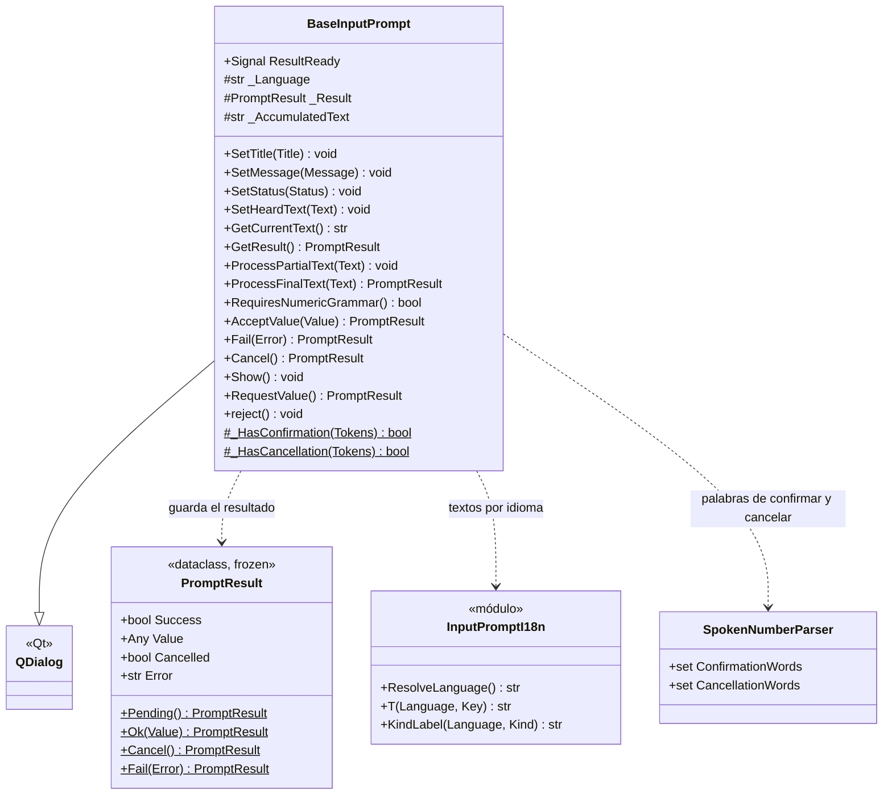
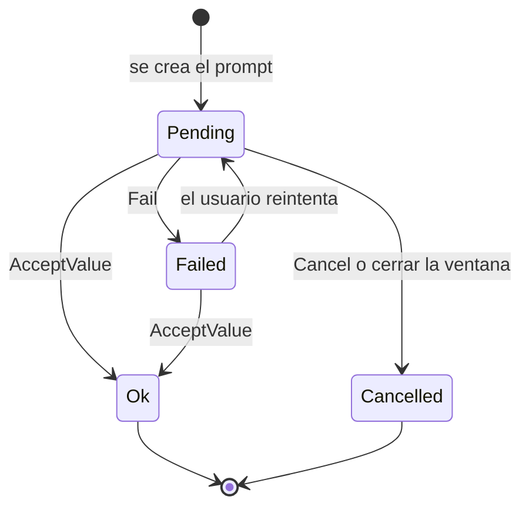

# BaseInputPrompt

> **Archivo:** `Dav/scr/ComponentesDAV/IntegracionGUI/GUIFreeCad/InputPrompts/BaseInputPrompt.py`

Clase base de todos los diálogos de voz. Es un `QDialog` con un mensaje, una línea
de estado, el texto que se escuchó y los botones *Aceptar* / *Cancelar*. No sabe
qué se le pide al usuario: cada subclase decide qué hacer con lo que oye
(`ProcessFinalText`) y cuándo dar el valor por bueno (`AcceptValue`).

## Responsabilidades

| Método | Qué hace |
| --- | --- |
| `ProcessFinalText(Text)` | Punto de extensión: la base solo muestra el texto. Las subclases lo reemplazan |
| `ProcessPartialText(Text)` | Muestra lo que se va reconociendo mientras el usuario habla |
| `AcceptValue(Value)` | Guarda `PromptResult.Ok`, emite `ResultReady` y cierra. Rechaza un texto vacío |
| `Fail(Error)` | Guarda el error y **deja el diálogo abierto** para reintentar |
| `Cancel()` | Guarda el resultado cancelado y cierra |
| `RequestValue()` | Lo muestra **modal** (`exec`) y devuelve el resultado al cerrarse |
| `Show()` | Lo muestra sin bloquear (lo usa [`GuidedExampleInputPrompt`](GuidedExampleInputPrompt.md)) |
| `RequiresNumericGrammar()` | `False` por defecto; los prompts numéricos devuelven `True` para que el router cambie la gramática |
| `reject()` | Cerrar la ventana cuenta como cancelar |

## Estados del resultado

## Notas de diseño

- **Tema claro u oscuro.** `_IsDarkTheme()` lee la preferencia de tema de FreeCAD (su
  paleta de Qt sigue siendo clara con el tema oscuro) y solo si no dice nada mira la
  paleta. Texto negro sobre claro, rojo sobre oscuro.
- **El idioma se lee al crear el prompt** con `ResolveLanguage()`, la misma fuente que
  usan el `Browser` y el `Tagger`.
- **PySide6 primero, PySide2 de respaldo**, como el resto de la GUI.
- **Subclases:** [`FileSelectionInputPrompt`](FileSelectionInputPrompt.md),
  [`ObjectSelectionInputPrompt`](ObjectSelectionInputPrompt.md),
  [`NumericInputPrompt`](NumericInputPrompt.md), [`YesNoInputPrompt`](YesNoInputPrompt.md),
  [`ChoiceInputPrompt`](ChoiceInputPrompt.md), [`PlaneSelectionInputPrompt`](PlaneSelectionInputPrompt.md),
  [`SpellingInputPrompt`](SpellingInputPrompt.md), `StringInputPrompt` y
  [`GuidedExampleInputPrompt`](GuidedExampleInputPrompt.md).
