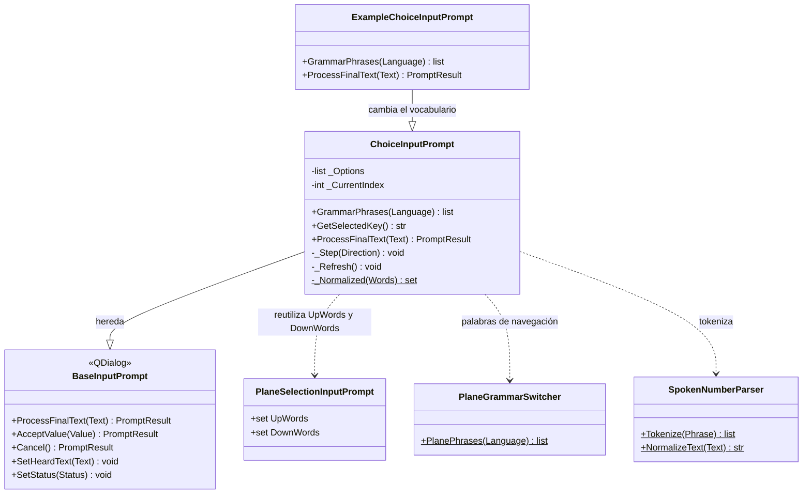

# ChoiceInputPrompt

> **Archivo:** `Dav/scr/ComponentesDAV/IntegracionGUI/GUIFreeCad/InputPrompts/ChoiceInputPrompt.py`

Diálogo de voz para elegir **una opción entre pocas** con nombre. Funciona como
el selector de plano ([`PlaneSelectionInputPrompt`](PlaneSelectionInputPrompt.md)):
`arriba`/`abajo` mueven la selección y `okey` confirma. Además, decir el nombre
de una opción la elige **de inmediato**. Lo usa `grabar` para elegir entre
*relieve* y *perforación*.



## Responsabilidades

| Método | Qué hace |
| --- | --- |
| `ProcessFinalText(Text)` | Cancelar aborta; nombrar una opción la acepta al instante; `abajo`/`arriba` mueven; una palabra de confirmación acepta la opción resaltada |
| `GrammarPhrases(Language)` | Gramática de Vosk: navegación, confirmar, cancelar y las palabras de cada opción |
| `GetSelectedKey()` | Clave de la opción resaltada |

## Cómo se arma

`Options` es una lista de tres valores por opción: `(clave, texto visible, palabras
que la eligen)`. El prompt devuelve la **clave**.

```python
askChoice("Grabar texto", "¿Relieve o perforación?", [
    ("emboss",  "Relieve (sobresale)",   ("relieve", "saliente", "relief")),
    ("engrave", "Perforación (hundido)", ("perforación", "hundido", "grabado")),
])
```

Se crea desde `askChoice` en
[`_prompts.py`](../../dic/Workbench/_prompts.py), que además acota la gramática
de Vosk mientras el diálogo está abierto y la restaura al terminar.

## Notas de diseño

- **Nombrar gana a navegar.** La búsqueda de palabras de opción va antes que la
  de `arriba`/`abajo`, así que una opción cuyo nombre coincidiera con una palabra
  de navegación se elegiría directamente.
- **Se comparan sin tildes.** Las palabras de cada opción se normalizan igual que
  lo que se oye (`perforación` = `perforacion`), pero a la gramática de Vosk van con
  la forma del vocabulario del modelo, tildes incluidas.
- **Sin estado global.** Todo lo que sabe viene en `Options`, por lo que sirve para
  cualquier elección corta y no solo para el grabado.
- **Tiene una subclase.** [`ExampleChoiceInputPrompt`](ExampleChoiceInputPrompt.md)
  reutiliza `_Step` y `GetSelectedKey`, pero navega con *retroceder* / *avanzar* y
  elige con *enviar*.
