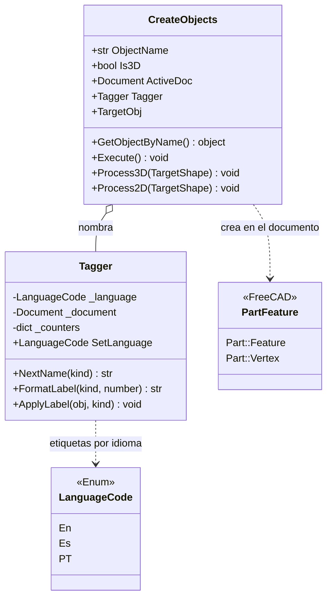

# CreateObjects

> **Archivo:** `Dav/scr/selection/createobjects.py` (usa `tagger.py`)

Extrae **los sub-elementos de una figura ya existente** y los convierte en objetos
propios del documento, con nombres secuenciales en el idioma activo. De un sólido
saca caras y aristas; de una figura plana, líneas y puntos. Los nombres los pone
[`Tagger`](#tagger): `Superficie1`, `Linea2`, `Punto3`…

## Qué crea `Execute()`

| Modo | Entrada | Salida |
| --- | --- | --- |
| `Is3D=True` (`Process3D`) | Un sólido | Un `Part::Feature` por **cara** (`surface`) y otro por **arista** (`edge`) |
| `Is3D=False` (`Process2D`) | Una figura plana | Un `Part::Feature` por arista (`line`) y un `Part::Vertex` por **vértice único** (`point`) |

Al final recalcula el documento. Los vértices repetidos se descartan comparando la
posición redondeada a 4 decimales.

## Tagger

| Método | Qué hace |
| --- | --- |
| `NextName(kind)` | Nombre único para `Name` (`Linea1`, `Linea2`…). Salta los que ya existen en el documento |
| `FormatLabel(kind, number)` | Texto para el árbol: «Superficie 3» |
| `ApplyLabel(obj, kind)` | Asigna `obj.Label` con el contador actual |

Tipos válidos: `point`, `line`, `surface`, `edge`. Otro tipo lanza `ValueError`.

## Notas de diseño

- **`Name` sin espacios, `Label` con espacio.** `Name` es el identificador interno de
  FreeCAD (`Linea1`); `Label` es lo que ve el usuario (`Linea 1`).
- **Se puede inyectar el `Tagger`** (`TaggerInstance`) para compartir contadores entre
  varias extracciones o para probar.
- **Errores por consola, no excepciones:** sin documento, objeto inexistente u objeto sin
  `Shape`, imprime el motivo y `Execute()` no hace nada.
- Estado de la integración de `selection/` al programa y lo que falta decidir:
  `pendientes-dav.md` §12.
