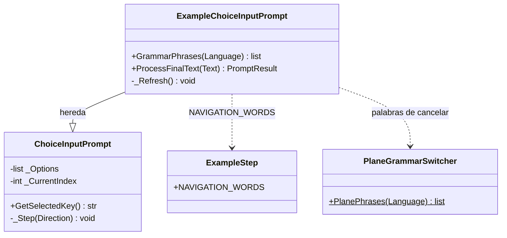

# ExampleChoiceInputPrompt

> **Archivo:** `Dav/scr/ComponentesDAV/IntegracionGUI/GUIFreeCad/InputPrompts/ExampleChoiceInputPrompt.py`

Selector de ejemplos. Hereda de [`ChoiceInputPrompt`](ChoiceInputPrompt.md) pero
cambia el vocabulario: **`retroceder`** y **`avanzar`** mueven la selección (con
vuelta al principio) y **`enviar`** elige. `cancelar` aborta. Devuelve la clave del
ejemplo elegido.

## Qué cambia respecto de la clase base

| Método | Diferencia |
| --- | --- |
| `GrammarPhrases(Language)` | Solo retroceder, avanzar, enviar y cancelar: no incluye nombres de opción |
| `ProcessFinalText(Text)` | No se elige nombrando la opción: solo se navega y se envía |
| `_Refresh()` | El estado muestra `(n/total)` y las palabras de navegación del idioma activo |

## Notas de diseño

- **Reutiliza `_Step` y `GetSelectedKey`** de la clase base; solo reemplaza el vocabulario.
- **Acepta las palabras de los tres idiomas**, como hace `FileSelectionInputPrompt`,
  pero la gramática de Vosk se acota al idioma activo.
- Lo abre `startExample()` en [`Examples`](Examples.md).
