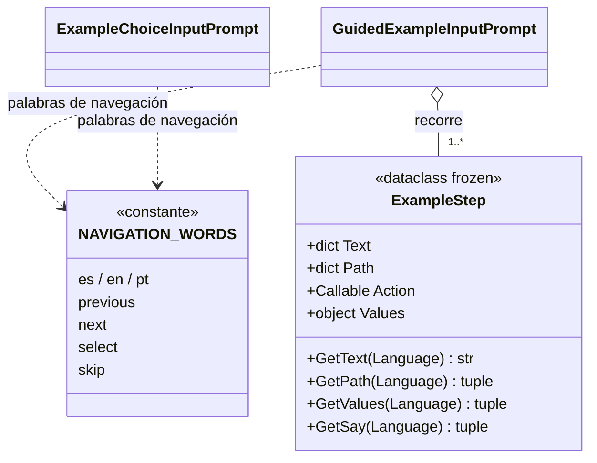

# ExampleStep

> **Archivo:** `Dav/scr/ComponentesDAV/IntegracionGUI/GUIFreeCad/InputPrompts/ExampleStep.py`

Un **cuadro** de un ejemplo guiado: qué se le muestra al usuario, **qué diría para
hacer lo mismo en DAV** y qué se ejecuta en FreeCAD cuando lo dice todo. Es un
`dataclass` inmutable. El mismo archivo define `NAVIGATION_WORDS`, las palabras
*retroceder / avanzar / enviar / saltar* en los tres idiomas, que comparten el
selector y el reproductor.

## Lo que dice el usuario: `Path` y `Values`

Lo que hay que decir en un cuadro es lo mismo que se diría para hacerlo sin ejemplo. Se
divide en dos partes que se dicen **en este orden**:

| Campo | Qué es | Ejemplo (es) |
| --- | --- | --- |
| `Path` | Las frases que **navegan el árbol de comandos** hasta llegar al comando. Cada elemento es una frase del diccionario (`"nuevo boceto"`, `"tres de"`) | `("banco", "croquis", "nuevo")` |
| `Values` | Lo que se **dicta en los diálogos** que abre el comando: números, `enviar`, `abajo` para moverse por una lista | `("cero", "enviar", "cero", "enviar", "doce", "enviar")` |

`GetSay(Language)` devuelve `Path + Values`: es lo que muestra y espera el reproductor.

`Values` puede ser un `dict` por idioma o una **función** `f(idioma) -> tuple` cuando lo
que se dicta depende del documento. Se evalúa cada vez que se muestra el cuadro, con el
documento tal como está en ese momento. Ejemplo: en el Dado, cuántas veces decir `abajo`
para llegar a una cara de la lista del selector.

## Campos

| Campo | Qué es |
| --- | --- |
| `Text` | Instrucción que se muestra, por idioma (`es`, `en`, `pt`) |
| `Path` | Frases de navegación, en orden, por idioma |
| `Action` | Función sin argumentos que hace el trabajo en FreeCAD |
| `Values` | Palabras dictadas en los diálogos del comando (opcional) |

## Notas de diseño

- **Cae al español.** `GetText`, `GetPath` y `GetValues` devuelven la versión en español si
  falta el idioma pedido.
- **Los datos no conocen la voz.** El cuadro solo declara qué se dice y qué se ejecuta; quién
  lo escucha y lo compara es [`GuidedExampleInputPrompt`](GuidedExampleInputPrompt.md).
- **`Path` se puede comprobar contra el árbol real** sin ejecutar nada: lo hace
  `tests/verify_examples_paths.py` (ver [`Examples`](Examples.md)). `Values` no, porque
  depende de los diálogos de cada comando.
- **El comando real y la acción no son lo mismo.** Lo que se dice es lo real; la `Action` llama
  directo a FreeCAD (o a la misma función de medida que usa el diccionario), así un ejemplo
  no abre diálogos modales ni depende de la selección del usuario.
