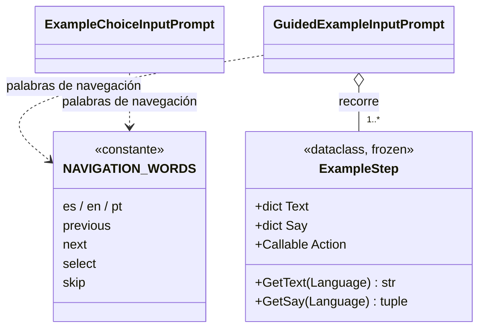

# ExampleStep

> **Archivo:** `Dav/scr/ComponentesDAV/IntegracionGUI/GUIFreeCad/InputPrompts/ExampleStep.py`

Un **cuadro** de un ejemplo guiado: qué se le muestra al usuario, qué palabras
debe decir y qué se ejecuta en FreeCAD cuando las dice todas. Es un `dataclass`
inmutable. El mismo archivo define `NAVIGATION_WORDS`, las palabras
*retroceder / avanzar / enviar / saltar* en los tres idiomas, que comparten el
selector y el reproductor.

## Campos

| Campo | Qué es |
| --- | --- |
| `Text` | Instrucción que se muestra, por idioma (`es`, `en`, `pt`) |
| `Say` | Palabras a decir, **en orden**, por idioma |
| `Action` | Función sin argumentos que hace el trabajo en FreeCAD |

## Notas de diseño

- **Cae al español.** `GetText` y `GetSay` devuelven la versión en español si
  falta el idioma pedido.
- **Los datos no conocen la voz.** El cuadro solo declara palabras y acción; quién
  las escucha y las compara es [`GuidedExampleInputPrompt`](GuidedExampleInputPrompt.md).
