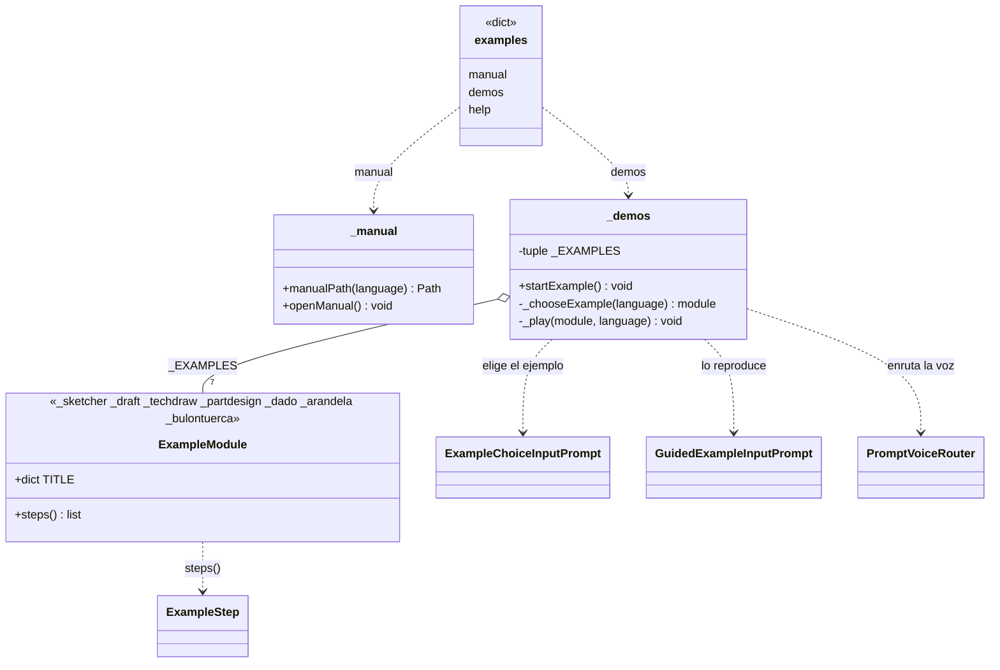

# Examples (carpeta `Explorer/Examples`)

> **Carpeta:** `Dav/dic/Explorer/Examples/`

Submenú del Explorer para aprender: abre el manual de usuario y lanza ejemplos
guiados. Se entra con *ejemplos*, *quiero aprender* o *aprender* (y sus
equivalentes en inglés y portugués). La carpeta no tiene ícono; sus dos hojas sí
(`manual.svg` y `demos.svg`).



## Hojas del submenú

| Clave | Palabras (es) | Qué hace |
| --- | --- | --- |
| `manual` | manual, referencia, guía | `openManual()`: abre `Manual_Usuario.pdf` (español) o `User_Manual.pdf` (inglés y portugués) |
| `demos` | ejemplos, demostraciones, tutorial | `startExample()`: selector de ejemplos y reproductor |
| `help` | ayuda | Ventana de ayuda del submenú |

## Ejemplos

| Módulo | Contenido | Medidas | Cuadros |
| --- | --- | --- | --- |
| `_sketcher` | Un círculo con restricción de radio | Cota 2D | 5 |
| `_draft` | Rectángulo, círculo y polígono | Cota 2D | 4 |
| `_techdraw` | Un círculo en una hoja A4 con rótulo | — | 4 |
| `_partdesign` | Un tornillo: cilindro, cono, prisma, chaflán y rosca con una hélice | Cota 3D y «tres de» | 9 |
| `_dado` | Un dado: el 1 con un cilindro, del 2 al 6 con un boceto y un vaciado por cara | Cota 3D, seis vistas y «tres de» | 25 |
| `_arandela` | Una arandela plana M6: dos círculos en un croquis, extrusión de 1,6 mm y una hoja de TechDraw con vista isométrica, vista del boceto y texto | Restricción de diámetro y cota 2D | 11 |
| `_bulontuerca` | Un bulón M6 (simplificado de la DIN 931) y su tuerca en PartDesign, y un ensamblaje con vínculos, bulón anclado y junta cilíndrica | Ensamblaje y «tres de» | 11 |

Cada módulo expone `TITLE` (por idioma) y `steps()`, que devuelve la lista de
[`ExampleStep`](ExampleStep.md). Para sumar un ejemplo alcanza con crear el módulo
y agregarlo a `_EXAMPLES` en `_demos.py`.

Archivos de apoyo: `_common.py` (documento activo, ajustar la vista, vistas estándar, ubicar una
primitiva) y `_words.py` (los números y palabras que se dictan en los diálogos, en los tres
idiomas: `numbers`, `send`, `down`, `nextItem`, `no`, `yes`).

## Lo que se dice es lo real

Los cuadros no inventan frases: cada `Path` es lo que un usuario diría, recorriendo el árbol, para
hacer eso mismo. El caso del círculo de un croquis:

```
banco → croquis → nuevo → enviar        (elige el plano)
geometría → círculo → círculo           (crea el círculo)
cero enviar · cero enviar · doce enviar  (centro X, centro Y, radio)
```

Los diálogos se reproducen tal como los pide cada comando; cada dato con su `enviar`. Cuando
lo dictado depende del documento (el Dado), `Values` es una función; ver [`ExampleStep`](ExampleStep.md).

## Verificación contra el árbol real

`tests/verify_examples_paths.py` (se lanza con `freecadcmd`) reproduce cada `Path`, en los tres
idiomas, por un `Browser` real, ejecuta las acciones y escribe un informe con el comando al que
llega cada cuadro. Sirve para detectar que:

- una frase no se resuelve (una palabra que falta en un `TraduceTo*`);
- una frase llega a **otro comando** por coincidencia aproximada (por ejemplo «cortar» dicho desde
  *Sumar* llegaba a «cotar»); se evita con «subir» antes;
- el contexto cambia por el camino (desde *Círculo*, «crear» salta a Workbench; por eso el
  polígono de Draft empieza con «subir»).

Para el Dado, tras «cerrar croquis» se vuelve a «banco» y «diseño», porque el cierre deja la voz
en *Croquis* aunque el boceto sea de un Body.

## Notas de diseño

- **Las claves no chocan con el ícono de la carpeta.** El panel busca el SVG por el
  nombre de la clave, por eso la hoja de ejemplos se llama `demos` y no `examples`:
  así la carpeta `examples` queda sin ícono.
- **Manual por idioma.** El portugués abre el manual en inglés porque no existe uno
  en portugués. El PDF se busca subiendo desde el archivo hasta la raíz del repo o
  de la instalación.
- **Ejemplos con la API de FreeCAD.** Lo que se **dice** es lo real, pero cada `Action` llama
  directo a FreeCAD (o a la misma función de cota del diccionario) y no pasa por los diálogos
  modales del comando; así el ejemplo funciona aunque el usuario esté en otro contexto y no
  depende de una selección previa.
- **Un solo ejemplo a la vez:** `_player` guarda el reproductor activo.
