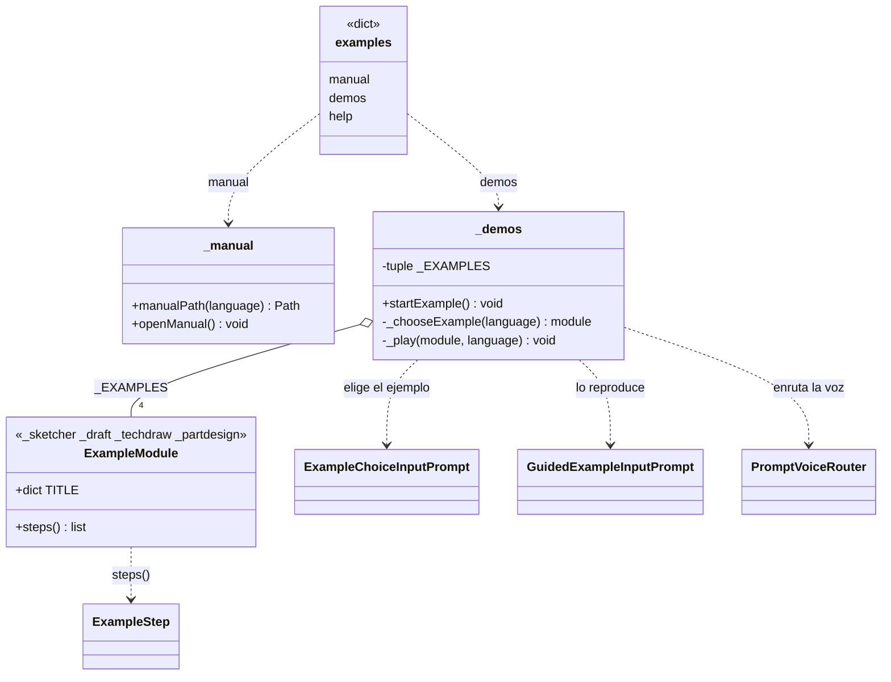

# Examples (carpeta `Explorer/Examples`)

> **Carpeta:** `Dav/dic/Explorer/Examples/`

Submenú del Explorer para aprender: abre el manual de usuario y lanza ejemplos
guiados. Se entra con *ejemplos*, *quiero aprender* o *aprender* (y sus
equivalentes en inglés y portugués). La carpeta no tiene ícono; sus dos hojas sí
(`manual.svg` y `demos.svg`).

## Hojas del submenú

| Clave | Palabras (es) | Qué hace |
| --- | --- | --- |
| `manual` | manual, referencia, guía | `openManual()`: abre `Manual_Usuario.pdf` (español) o `User_Manual.pdf` (inglés y portugués) |
| `demos` | ejemplos, demostraciones, tutorial | `startExample()`: selector de ejemplos y reproductor |
| `help` | ayuda | Ventana de ayuda del submenú |

## Ejemplos

| Módulo | Contenido | Cuadros |
| --- | --- | --- |
| `_sketcher` | Rectángulo con restricciones | 5 |
| `_draft` | Rectángulo, círculo, línea, texto y copia | 5 |
| `_techdraw` | Círculo en una hoja A4 con rótulo | 4 |
| `_partdesign` | Tornillo de cabeza hexagonal con chaflán y rosca | 7 |

Cada módulo expone `TITLE` (por idioma) y `steps()`, que devuelve la lista de
[`ExampleStep`](ExampleStep.md). Para sumar un ejemplo alcanza con crear el módulo
y agregarlo a `_EXAMPLES` en `_demos.py`.

## Notas de diseño

- **Las claves no chocan con el ícono de la carpeta.** El panel busca el SVG por el
  nombre de la clave, por eso la hoja de ejemplos se llama `demos` y no `examples`:
  así la carpeta `examples` queda sin ícono.
- **Manual por idioma.** El portugués abre el manual en inglés porque no existe uno
  en portugués. El PDF se busca subiendo desde el archivo hasta la raíz del repo o
  de la instalación.
- **Ejemplos con la API de FreeCAD.** Cada `Action` llama directo a FreeCAD (no pasa
  por el árbol de diccionarios), así un ejemplo funciona aunque el usuario esté en
  otro contexto.
- **Un solo ejemplo a la vez:** `_player` guarda el reproductor activo.
