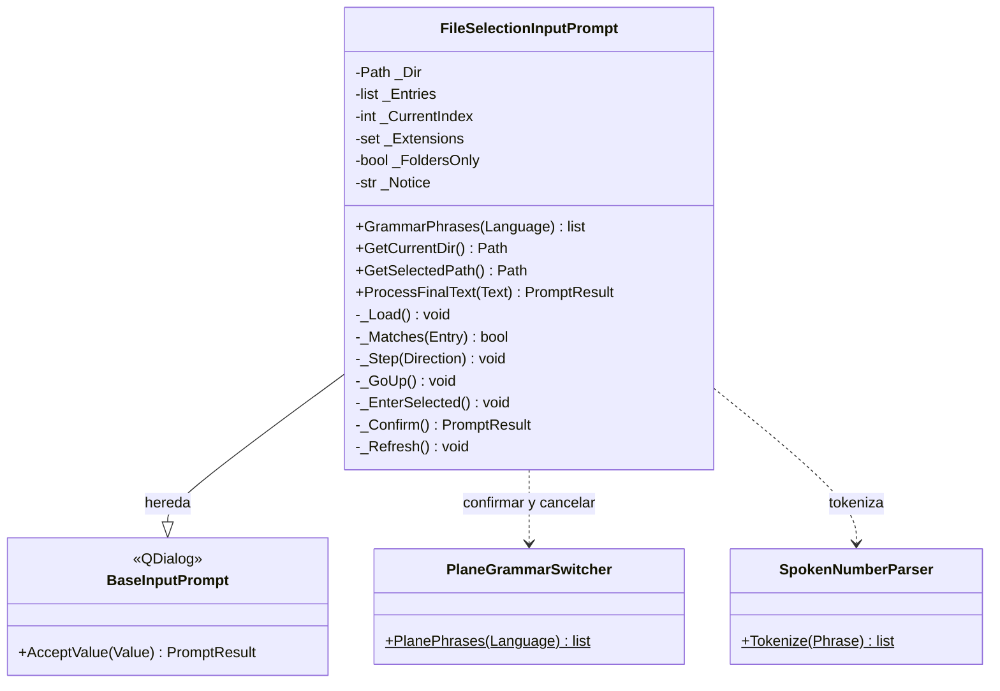

# FileSelectionInputPrompt

> **Archivo:** `Dav/scr/ComponentesDAV/IntegracionGUI/GUIFreeCad/InputPrompts/FileSelectionInputPrompt.py`

Navegador de carpetas por voz. Los nombres de archivo **no se pueden dictar** (no
están en el vocabulario de Vosk), así que se recorre la lista con
*siguiente / anterior*, se entra a una carpeta con *abrir*, se sube con *subir* y
se confirma con *okey*. Lo usa el submenú Proyecto (abrir, guardar y exportar sin
los diálogos nativos de FreeCAD).

## Palabras

| Rol | es | en | pt |
| --- | --- | --- | --- |
| Siguiente | siguiente, avanzar, abajo, próximo, otro | next, forward, down, advance | seguinte, próximo, avançar, abaixo |
| Anterior | anterior, atrás, retroceder, arriba, previo | previous, back, up | anterior, voltar, cima |
| Subir | subir, padre | parent, out | subir, pai |
| Entrar | abrir, adentro | open, inside | abrir, dentro |
| Elegir | elegir, seleccionar | choose, select | escolher, selecionar |

`entrar` **no** sirve para meterse en una carpeta porque ya es una palabra de
confirmación.

## Modos

| Modo | Lista | `okey` |
| --- | --- | --- |
| Archivos (por defecto) | Carpetas y luego archivos, filtrados por `Extensions` | Sobre un archivo lo elige; sobre una carpeta **entra** |
| Solo carpetas (`FoldersOnly=True`) | Solo carpetas | Elige la carpeta que se está viendo, así una carpeta sin subcarpetas también se puede elegir |

El valor aceptado es la ruta elegida, como texto.

## Notas de diseño

- Las carpetas van antes que los archivos y cada grupo se ordena sin distinguir
  mayúsculas (`casefold`). Se ocultan las entradas que empiezan con punto.
- Si la carpeta no se puede leer, el error se muestra como aviso y la lista queda vacía.
- Quien lo abra debe acotar la gramática con `GrammarPhrases` y registrarlo en
  [`PromptVoiceRouter`](PromptVoiceRouter.md); ver `_browse` en `Explorer/Proyecto/_project.py`.
