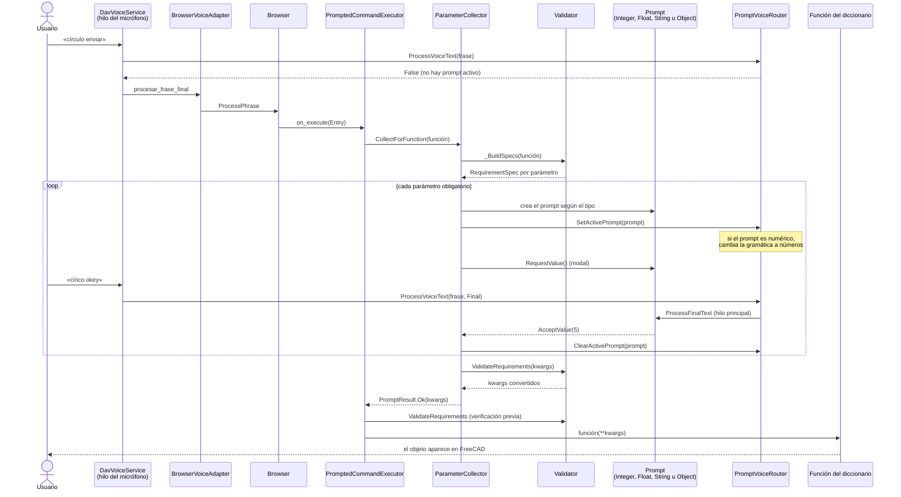
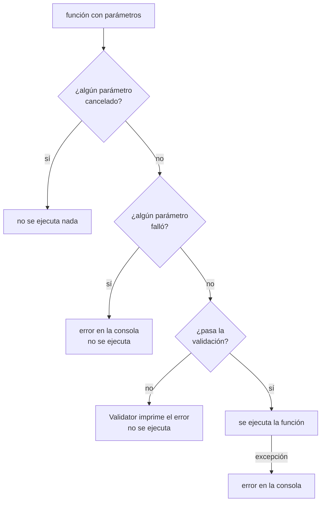

# Flujo de un comando con parámetros

Qué pasa desde que el usuario dice un comando que necesita valores (por ejemplo
«círculo», que pide radio) hasta que la función corre en FreeCAD. Reúne a
[`Browser`](Browser.md), [`PromptedCommandExecutor`](PromptedCommandExecutor.md),
[`ParameterCollector`](ParameterCollector.md), [`Validator`](Validator.md), los
diálogos de voz y [`PromptVoiceRouter`](PromptVoiceRouter.md).

## Secuencia

## Qué puede cortar el flujo

## Puntos a tener en cuenta

- **Mientras un prompt está activo, el `Browser` no oye.** El router consume las frases
  (`ProcessVoiceText` devuelve `True`), y por eso el registro se libera siempre en un
  `finally`.
- **Los textos de los diálogos se resuelven con el idioma actual**, no con el de arranque
  (ver la propiedad `Language` de `ParameterCollector`).
- **Los tipos salen de la firma de la función.** Una anotación `int` abre un prompt
  numérico entero, `float` uno decimal, `str` uno de texto y cualquier otra cosa uno de
  selección de objetos. Los parámetros con valor por defecto **no se piden**.
- **Otros diálogos no pasan por acá.** Los comandos que arman su propia conversación
  (elegir un plano, abrir un archivo, un ejemplo guiado) abren directamente su prompt
  con los helpers de `Workbench/_prompts.py`; ver
  [`guia-contribuir-dav.md`](../guia-contribuir-dav.md).
- **Probar sin micrófono:** `ExecuteEntry(Entry, SimulatedFinalTexts=["cinco okey"])`.
