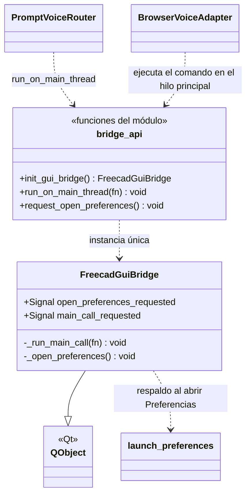
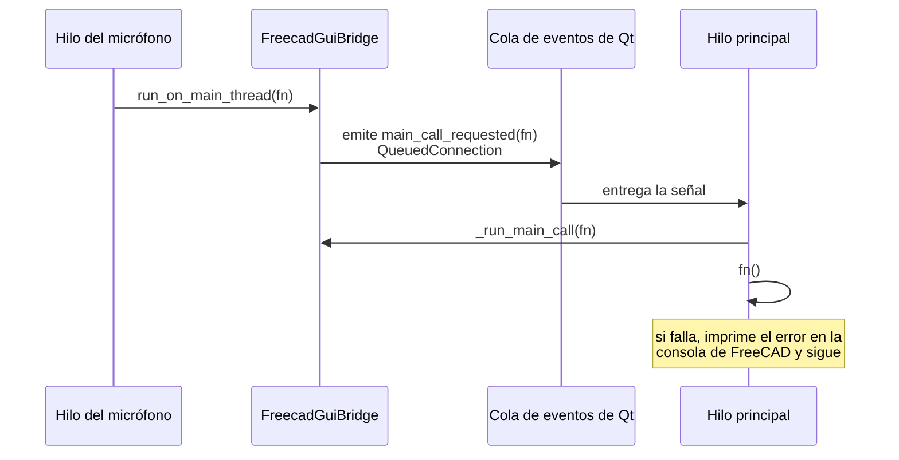

# FreecadGuiBridge

> **Archivo:** `Dav/scr/ComponentesDAV/IntegracionGUI/GUIFreeCad/integration/freecad_gui_bridge.py`

Puente **del hilo del micrófono al hilo principal de Qt**. Los comandos de FreeCAD
(`Gui.runCommand`, crear objetos, abrir diálogos) solo pueden ejecutarse desde el
hilo de la interfaz, pero la voz se reconoce en otro. El puente recibe una función
desde cualquier hilo y la encola para que corra en el principal.

## Cómo funciona

## Responsabilidades

| Elemento | Qué hace |
| --- | --- |
| `run_on_main_thread(fn)` | Encola `fn` en el hilo principal. Es seguro llamarla desde cualquier hilo |
| `request_open_preferences()` | Pide abrir las Preferencias de DAV desde el hilo de voz |
| `init_gui_bridge()` | Crea el puente la primera vez y devuelve siempre el mismo |
| `_run_main_call(fn)` | Ejecuta la función; un error se informa pero **no derriba el hilo de la interfaz** |
| `_open_preferences()` | Intenta `Gui.runCommand("DAV_OpenPreferences")`; si falla usa [`launch_preferences`](LaunchPreferences.md) |

## Notas de diseño

- **`QueuedConnection` es lo que cambia de hilo.** Con una conexión directa la función
  correría en el hilo que emite, no en el de Qt.
- **Instancia única perezosa:** el `QObject` debe crearse en el hilo principal; por eso
  `init_gui_bridge()` se llama al preparar la voz (`freecad_voice_setup.py`) y no desde el hilo de voz.
- Si `run_on_main_thread` no está disponible (fuera de FreeCAD), `PromptVoiceRouter` ejecuta
  la función directamente.
