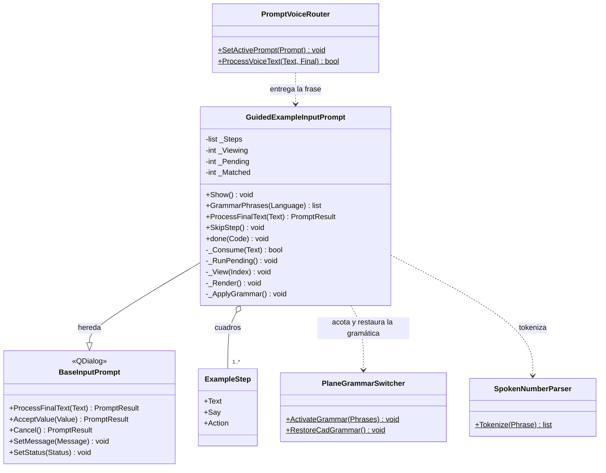
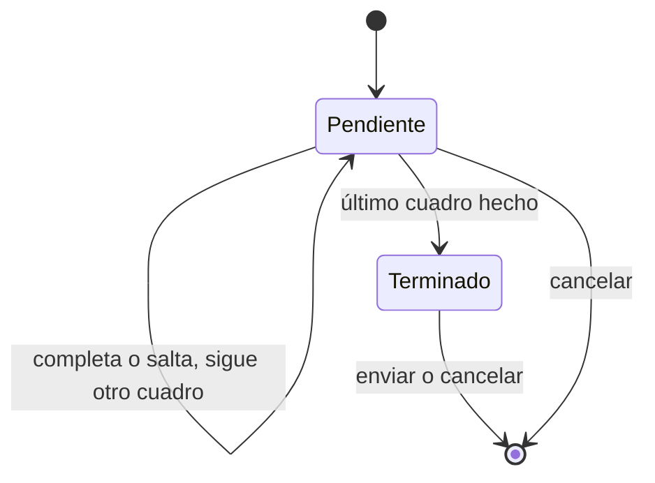

# GuidedExampleInputPrompt

> **Archivo:** `Dav/scr/ComponentesDAV/IntegracionGUI/GUIFreeCad/InputPrompts/GuidedExampleInputPrompt.py`

Reproductor de ejemplos guiados. Muestra **un cuadro por vez** con las palabras
que el usuario debe decir; cuando las dice todas, en orden, ejecuta la acción del
cuadro y pasa al siguiente. A diferencia del resto de los prompts es **no modal**:
el usuario ve cómo se arma la pieza en la vista 3D mientras sigue el ejemplo.

## Responsabilidades

| Método | Qué hace |
| --- | --- |
| `ProcessFinalText(Text)` | Cancelar cierra; en el cuadro pendiente compara las palabras o salta; *retroceder*/*avanzar* repasan cuadros; al terminar, *enviar* cierra |
| `_Consume(Text)` | Busca en la frase las palabras pendientes **en orden**; guarda el avance entre frases; al completarlas llama a `_RunPending` |
| `_RunPending()` | Ejecuta `Action`; si falla, el cuadro no avanza y se muestra el error |
| `SkipStep()` | Ejecuta el cuadro sin decir sus palabras (también es el botón de la ventana) |
| `GrammarPhrases(Language)` | Navegación, cancelar y las palabras del **cuadro actual** |
| `Show()` | Muestra la ventana abajo a la derecha del editor, sin bloquearlo |
| `done(Code)` | Restaura la gramática de CAD al cerrarse |

## Estado

- `_Pending`: primer cuadro sin hacer. `_Viewing`: el que se ve. Solo se puede
  volver a cuadros anteriores (`_Viewing ≤ _Pending`), nunca saltarse uno.
- `_Matched`: palabras ya dichas del cuadro pendiente.

## Notas de diseño

- **Las palabras se acumulan entre frases** dentro de un mismo cuadro, pero una
  palabra fuera de orden no cuenta.
- **La gramática se acota por cuadro:** Vosk solo escucha las palabras del cuadro
  actual y la navegación, lo que mejora el reconocimiento.
- **No modal:** por eso `startExample()` guarda la referencia del reproductor y
  registra la limpieza del router en `finished`.
- El botón *Aceptar* del prompt base pasa a ser *Saltar cuadro* y *Cancelar* pasa a *Cerrar*.
