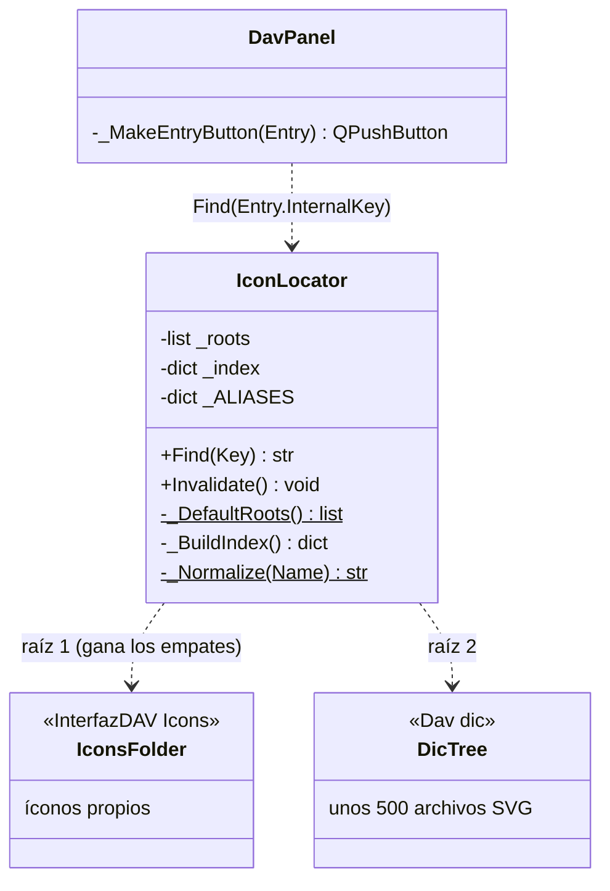
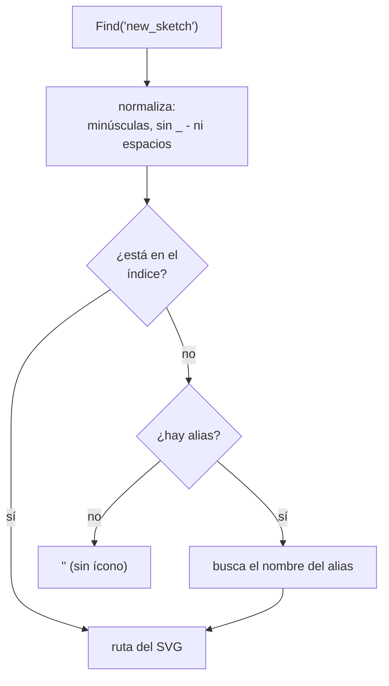

# IconLocator

> **Archivo:** `Dav/scr/ComponentesDAV/InterfazDAV/IconLocator.py`

Encuentra el **SVG de una clave del diccionario** para que [`DavPanel`](DavPanel.md)
dibuje el ícono de cada botón. Indexa las carpetas de íconos **una sola vez** (al
primer pedido) y reutiliza el índice. Antes se recorría todo el árbol por cada botón
y en cada repintado, sin caché.

## Cómo busca

## Reglas que hay que conocer al agregar un SVG

| Regla | Consecuencia |
| --- | --- |
| **Se busca por el nombre de la clave**, no por la carpeta | Para que un botón tenga ícono, el SVG se llama como su clave: clave `save` → `save.svg` |
| **El nombre se normaliza** | `lineattributes` = `LineAttributes.svg`; `new_sketch` = `NewSketch.svg` |
| **La primera raíz que define un nombre gana** | Un ícono en `InterfazDAV/Icons` pisa al del árbol de diccionarios |
| **Un nombre repetido en el árbol: gana el primero que se encuentra** | Dos carpetas con `open.svg` comparten ícono: `setdefault` no distingue carpetas |
| **Sin SVG no hay error** | `Find` devuelve `""` y el panel usa su respaldo de dos letras |
| **`_ALIASES`** | Claves cuyo ícono existe con otro nombre: `pieza`→`part`, `circulo`→`circle`, `stdview`→`standardviews` |

## Notas de diseño

- **Una carpeta sin ícono es válida y a veces deseada**: por eso la hoja de ejemplos
  se llama `demos` y no `examples`; así la carpeta `examples` queda sin SVG.
  Ver [`Examples`](Examples.md).
- **La raíz de `Dav/dic` se valida** buscando `base.py` (`ComponentesDAV/Dav/dic` es un
  marcador de posición vacío que aparece antes en la cadena de ancestros).
- `Invalidate()` descarta el índice; el próximo `Find` vuelve a recorrer las carpetas.
