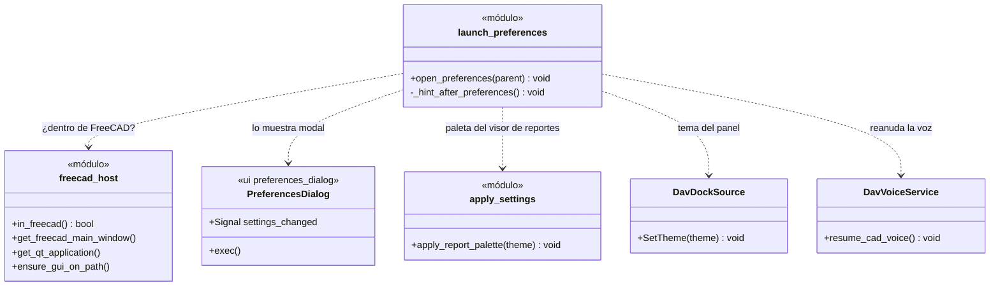
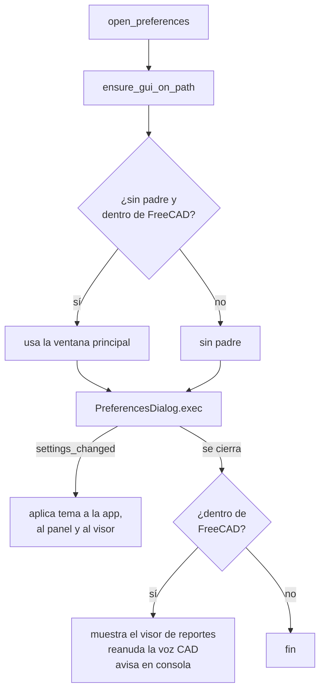

# LaunchPreferences

> **Archivo:** `Dav/scr/ComponentesDAV/IntegracionGUI/GUIFreeCad/integration/launch_preferences.py`

Abre el **diálogo de Preferencias de DAV** dentro de FreeCAD (o suelto, en pruebas)
y, al cerrarse, aplica lo que cambió: el tema, el panel acoplado y la voz. Es el
callable que ejecuta el comando «preferencias» del diccionario raíz.

## Qué pasa al abrir

## Notas de diseño

- **Es modal.** Al cerrarlo, dentro de FreeCAD, se llama a `DavVoiceService.resume_cad_voice()`
  para que la voz vuelva a controlar CAD.
- **Los cambios se aplican en vivo** (`settings_changed`), sin reiniciar FreeCAD.
- **Cada aplicación está en su `try`:** si el panel no existe o falla la paleta, el
  resto igual se aplica.
- Puede abrirse desde el hilo de voz con
  [`FreecadGuiBridge`](FreecadGuiBridge.md) (`request_open_preferences`).
- Ver también [`Preferences`](Preferences.md), que guarda y persiste la configuración.
