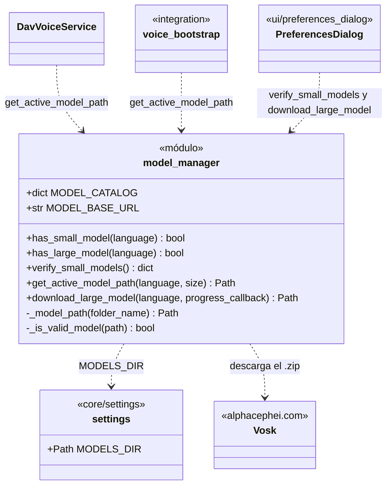
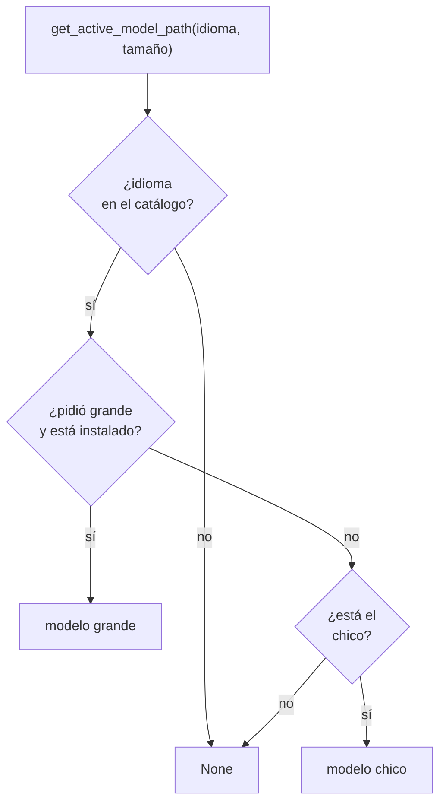

# ModelManager

> **Archivo:** `Dav/scr/ComponentesDAV/IntegracionGUI/GUIFreeCad/core/model_manager.py`

Módulo de funciones (no una clase) que **verifica y descarga los modelos de Vosk**.
Cada idioma tiene un modelo *chico* (viene con el proyecto) y uno *grande* (se baja
a pedido). Decide qué carpeta usar según la preferencia de tamaño y qué hay en disco.

## Catálogo

| Idioma | Modelo chico | Modelo grande |
| --- | --- | --- |
| `es` | `vosk-model-small-es-0.42` | `vosk-model-es-0.42` |
| `en` | `vosk-model-small-en-us-0.15` | `vosk-model-en-us-0.22` |
| `pt` | `vosk-model-small-pt-0.3` | `vosk-model-pt-fb-v0.1.1-20220516_2113` |

## Qué modelo se elige

## Notas de diseño

- **Un modelo es válido si la carpeta tiene alguno de sus archivos característicos**
  (`am`, `graph`, `conf`, `ivector`, `final.mdl`, `Gr.fst`). Una carpeta vacía o a medio
  descargar no cuenta.
- **Pedir el grande sin tenerlo cae al chico**, así el reconocimiento nunca queda sin modelo
  si el chico está.
- **`download_large_model`** baja el `.zip`, lo descomprime en `MODELS_DIR`, borra el `.zip`
  y valida el resultado; si la carpeta extraída tiene otro nombre, la renombra. Informa el
  progreso con un `progress_callback(descargado, total)`.
- **El tamaño** lo da `settings.model_size` (preferencia del usuario).
- **La carpeta de modelos** sale de `core/settings.py` y respeta `DAV_MODELS_DIR`.
- Un modelo grande **no mejora** el reconocimiento de comandos: ver `pendientes-dav.md` §10.
