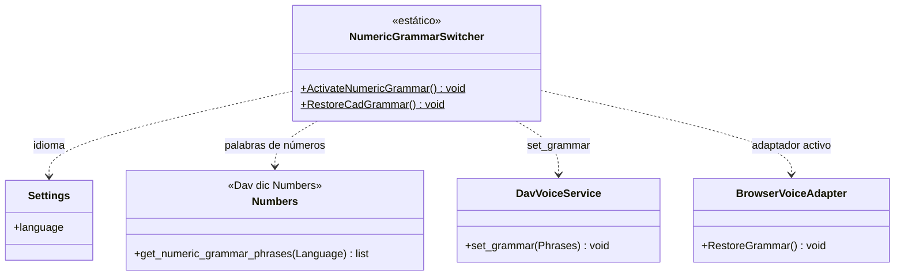

# NumericGrammarSwitcher

> **Archivo:** `Dav/scr/ComponentesDAV/IntegracionGUI/GUIFreeCad/InputPrompts/NumericGrammarSwitcher.py`

Cambia la gramática de Vosk **entre la de CAD y la de dictado de números**. Está
separada de [`PromptVoiceRouter`](PromptVoiceRouter.md) a propósito: el router solo
sabe *qué prompt está activo*; cambiar la gramática es otra responsabilidad, con sus
propias dependencias.

## Responsabilidades

| Método | Qué hace |
| --- | --- |
| `ActivateNumericGrammar()` | Pide a `Numbers` las frases de números del idioma activo y se las da a Vosk |
| `RestoreCadGrammar()` | Le pide al adaptador activo del `Browser` que recalcule la gramática del contexto actual |

## Notas de diseño

- **El vocabulario numérico vive en el diccionario** (`Dav/dic/Numbers/`), no en el
  código: agregar un sinónimo es editar un `TraduceTo*.py`. Ver
  [`numeros-diccionario-gramatica.md`](../numeros-diccionario-gramatica.md).
- **Falla en silencio:** ambos métodos capturan las excepciones. Si no hay voz (por
  ejemplo en pruebas), un prompt numérico sigue funcionando con texto simulado.
- Lo dispara `PromptVoiceRouter` cuando el prompt registrado devuelve `True` en
  `RequiresNumericGrammar()`; ver [`NumericInputPrompt`](NumericInputPrompt.md).
