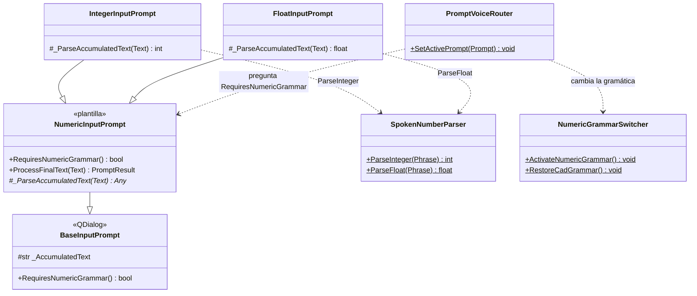
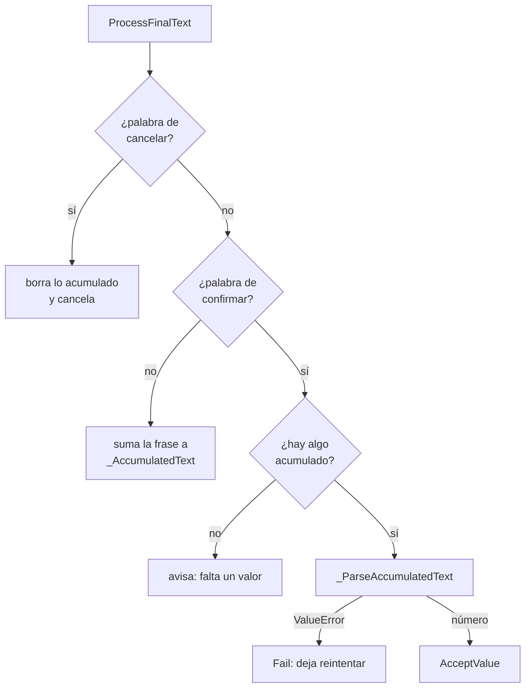

# NumericInputPrompt

> **Archivo:** `Dav/scr/ComponentesDAV/IntegracionGUI/GUIFreeCad/InputPrompts/NumericInputPrompt.py`

Plantilla de los prompts que piden **un número dictado**. Guarda lo que el usuario
va diciendo aunque lo haga en varias frases («cinco» … «coma» … «dos» … «okey») y
recién cuando oye una palabra de confirmación lo convierte. Las subclases solo
implementan **cómo convertir** el texto acumulado.

## Flujo de una frase

## Notas de diseño

- **Patrón plantilla.** El flujo acumular / confirmar / cancelar vive una sola vez acá; un
  tipo numérico nuevo solo sobreescribe `_ParseAccumulatedText`.
- **`RequiresNumericGrammar()` devuelve `True`.** Así [`PromptVoiceRouter`](PromptVoiceRouter.md)
  cambia la gramática de Vosk a las palabras de números **sin comprobar tipos concretos**.
- La conversión de palabras a número (incluido «coma», «menos» y decenas) está en
  [`SpokenNumberParser`](SpokenNumberParser.md).
- Un error de conversión (`ValueError`) usa `Fail`: el diálogo queda abierto y lo acumulado
  ya se descartó, así que el usuario vuelve a dictar el número.
