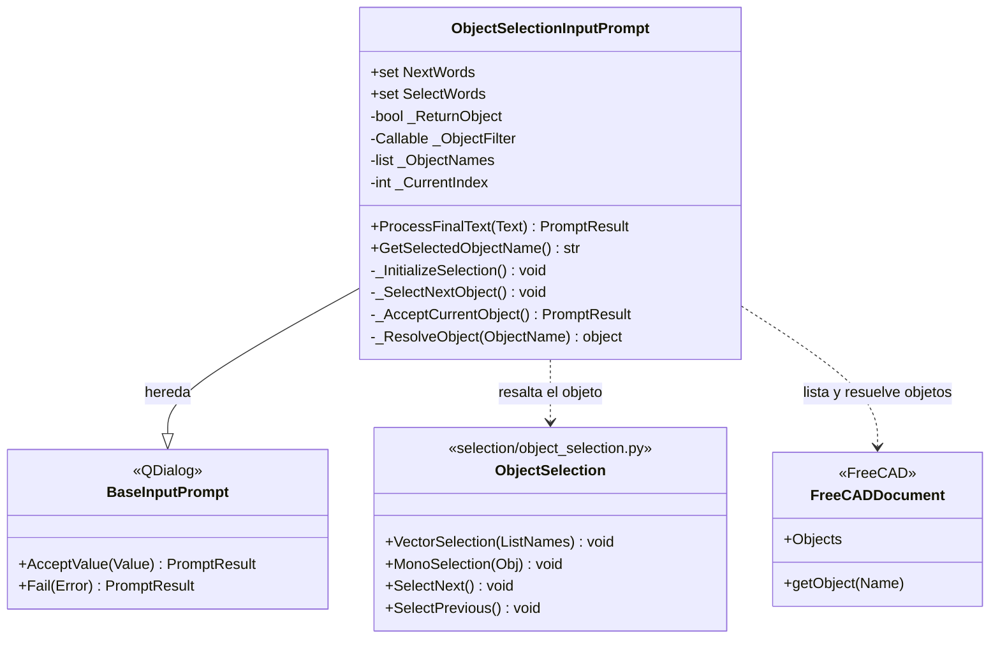

# ObjectSelectionInputPrompt

> **Archivo:** `Dav/scr/ComponentesDAV/IntegracionGUI/GUIFreeCad/InputPrompts/ObjectSelectionInputPrompt.py`

Elige **un objeto del documento activo** recorriéndolos por voz: *siguiente*
resalta el próximo (en la vista 3D y en el árbol) y *okey* o *seleccionar* lo
confirma. Es el prompt que crea `ParameterCollector` para los parámetros de tipo
objeto.

## Cómo funciona

1. Al crearse toma los objetos del documento activo. Si se pasó `ObjectFilter`, solo
   quedan los que devuelven `True`.
2. Sin documento, o sin objetos que cumplan, hace `Fail` con un mensaje y no ofrece nada.
3. `siguiente` (o *otro*, *avanzar*, *next*, *seguinte*…) pasa al próximo, con vuelta
   al principio.
4. `okey` o `seleccionar` acepta el objeto resaltado.

| `ReturnObject` | Valor aceptado |
| --- | --- |
| `False` (por defecto) | El **nombre** del objeto (texto) |
| `True` | El objeto de FreeCAD; si no se puede resolver, cae al nombre |

## Notas de diseño

- **El filtro es lo que lo vuelve reutilizable.** `askObject` en `Workbench/_prompts.py`
  lo usa con filtros como `isProfile` o `isSolid` para ofrecer solo bocetos o solo piezas.
- **Importa `ObjectSelection` con varios respaldos** de ruta, porque `scr/selection/`
  puede no estar en `sys.path` cuando corre dentro de FreeCAD.
- Detalle de la integración de `selection/` al programa: `pendientes-dav.md` §12.
