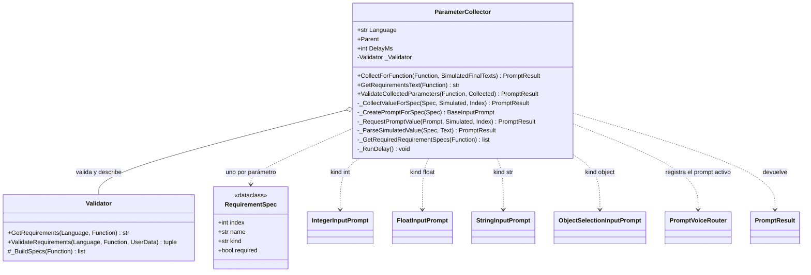

# ParameterCollector

> **Archivo:** `Dav/scr/ComponentesDAV/IntegracionGUI/GUIFreeCad/InputPrompts/ParameterCollector.py`

Junta **todos los parámetros que necesita una función** del diccionario. Mira la
firma de la función (con ayuda del [`Validator`](Validator.md)), abre un diálogo de
voz por cada parámetro obligatorio según su tipo y al final valida el conjunto.
Devuelve un `PromptResult` cuyo valor es el diccionario de argumentos listo para
llamar a la función.

## Qué prompt abre cada tipo

| `kind` | Prompt | Valor |
| --- | --- | --- |
| `int` | [`IntegerInputPrompt`](NumericInputPrompt.md) | `int` |
| `float` | [`FloatInputPrompt`](NumericInputPrompt.md) | `float` |
| `str` | `StringInputPrompt` | texto sin la palabra de confirmar |
| `object` (y todo lo demás) | [`ObjectSelectionInputPrompt`](ObjectSelectionInputPrompt.md) | nombre del objeto |

## Responsabilidades

| Método | Qué hace |
| --- | --- |
| `CollectForFunction(Function, Simulated)` | Recorre los parámetros **obligatorios**, los pide uno a uno y valida el conjunto. Sin parámetros obligatorios devuelve `Ok({})` |
| `_RequestPromptValue` | Registra el prompt en [`PromptVoiceRouter`](PromptVoiceRouter.md), lo muestra modal y **siempre** lo libera al terminar |
| `GetRequirementsText(Function)` | Texto localizado de los requisitos (lo arma `Validator`) |
| `ValidateCollectedParameters` | Convierte y valida los valores con `Validator.ValidateRequirements` |
| `_RunDelay()` | Pausa `DelayMs` con un `QEventLoop` entre un prompt y el siguiente, sin congelar la interfaz |

## Notas de diseño

- **Si se cancela cualquier parámetro se cancela todo:** el resultado cancelado sube tal cual y la función no se ejecuta.
- **Modo simulado.** `SimulatedFinalTexts` reemplaza a la voz con una lista de frases
  (una por parámetro, cada una terminada en «okey»). Permite probar la recolección sin
  micrófono ni ventanas.
- **El idioma se lee cada vez.** `Language` consulta `ResolveLanguage()` en vivo: el
  colector se crea una sola vez al arrancar la voz y, si guardara el idioma de ese
  momento, los títulos quedarían en el idioma anterior tras cambiarlo en Preferencias.
- **Respaldo sin `Validator`:** `_BuildFallbackSpecs` arma las especificaciones desde las
  anotaciones de tipo de la función (`int`, `float`, `str`; cualquier otra cosa es `object`).
- Flujo completo: [`FlujoComandoConParametros`](FlujoComandoConParametros.md).
