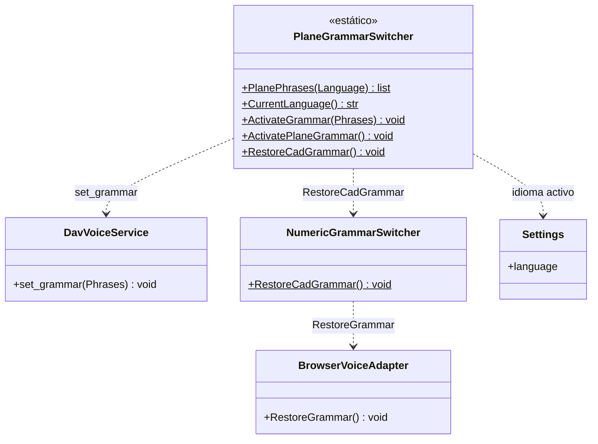

# PlaneGrammarSwitcher

> **Archivo:** `Dav/scr/ComponentesDAV/IntegracionGUI/GUIFreeCad/InputPrompts/PlaneGrammarSwitcher.py`

Acota la gramática de Vosk a **las pocas palabras que entiende un diálogo**. Con el
vocabulario abierto, Vosk confunde las palabras de navegación con otras parecidas;
con una gramática chica el reconocimiento mejora mucho. Aunque se llama
«Plane», hoy lo usan todos los prompts con vocabulario propio.



## Responsabilidades

| Método | Qué hace |
| --- | --- |
| `PlanePhrases(Language)` | Frases mínimas: arriba/abajo, confirmación (okey, enviar, listo…) y cancelación |
| `CurrentLanguage()` | Idioma configurado (`es` si no se puede leer) |
| `ActivateGrammar(Phrases)` | Restringe Vosk a esas frases. Si falla, el reconocimiento sigue con vocabulario abierto |
| `RestoreCadGrammar()` | Devuelve la gramática del contexto actual del `Browser` |

## Patrón de uso

```python
PlaneGrammarSwitcher.ActivateGrammar(prompt.GrammarPhrases(idioma))
PromptVoiceRouter.SetActivePrompt(prompt)
try:
    resultado = prompt.RequestValue()
finally:
    PromptVoiceRouter.ClearActivePrompt(prompt)
    PlaneGrammarSwitcher.RestoreCadGrammar()
```

## Notas de diseño

- **Las palabras deben existir también en `NavCommands/TraduceTo*.py` o en
  `SpokenNumberParser`**, para que el prompt las reconozca cuando llega el texto final.
- **Nunca rompe el diálogo:** todos los métodos que hablan con Vosk están dentro de
  `try` / `except`. Sin gramática acotada se nota, pero el selector sigue andando.
- Cómo se acota la gramática del `Browser`: [`acortador-gramatica-vosk.md`](../acortador-gramatica-vosk.md).
