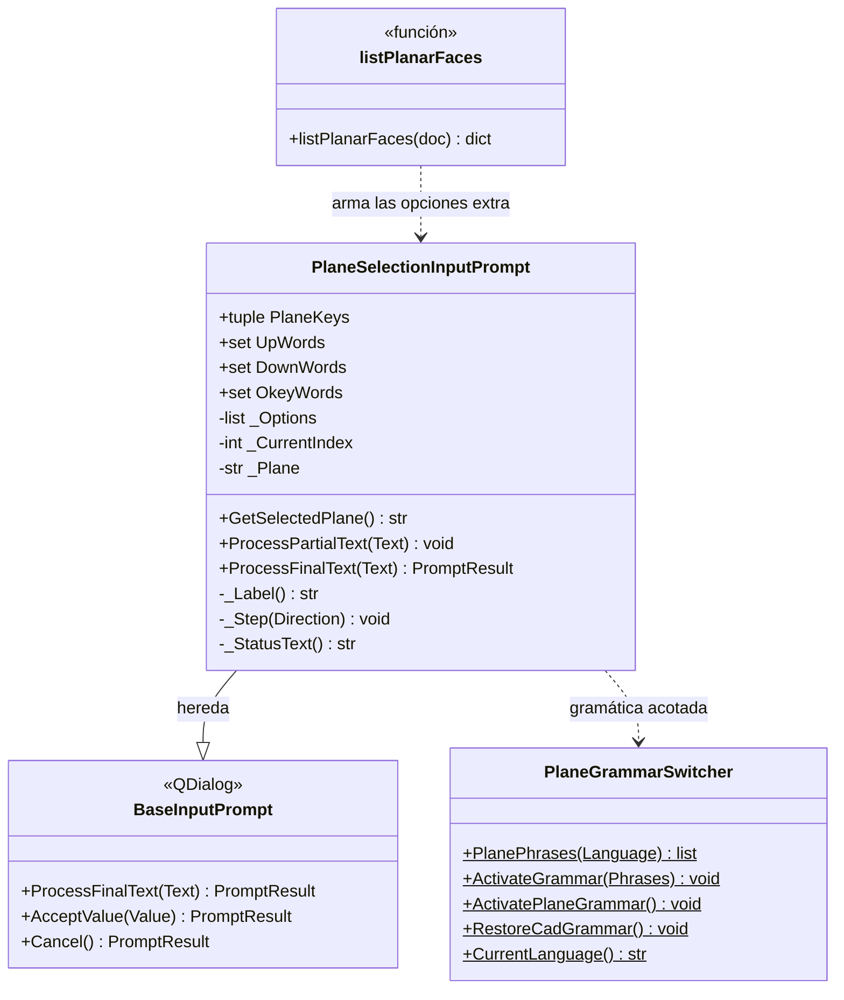

# PlaneSelectionInputPrompt

> **Archivo:** `Dav/scr/ComponentesDAV/IntegracionGUI/GUIFreeCad/InputPrompts/PlaneSelectionInputPrompt.py`

Selector de voz que reemplaza al diálogo nativo de FreeCAD para elegir dónde
dibujar un croquis. Muestra los tres planos base (`XY`, `XZ`, `YZ`) y, cuando hay
un sólido, **las caras** sobre las que se puede dibujar. Lo usan «nuevo croquis»
(PartDesign, Part y Sketcher) y `grabar`.

Cómo se ve para el usuario: ver
[`manual-croquis-y-grabado-voz.md`](../manual-croquis-y-grabado-voz.md).

## Responsabilidades

| Método | Qué hace |
| --- | --- |
| `__init__(..., ExtraOptions)` | Lista los tres planos y, después, las opciones extra `(clave, etiqueta)` (las caras) |
| `ProcessFinalText(Text)` | `arriba`/`abajo` recorren la lista de forma circular; `okey` acepta; `cancelar` aborta |
| `GetSelectedPlane()` | Clave de la opción resaltada: `XY`, `XZ`, `YZ` o la clave de una cara (`Face3`) |

## Notas de diseño

- **Los planos van primero, siempre.** Con `ExtraOptions` vacío el comportamiento
  es idéntico al anterior; quien llama sin caras (por ejemplo `askPlane()` del
  espejo) sigue viendo solo `XY`, `XZ` y `YZ`.
- **El prompt no sabe qué es una cara.** Solo recibe `(clave, etiqueta)`; quien
  llama guarda qué sólido y qué cara hay detrás de cada clave
  (`listPlanarFaces`, en `Sketcher/new_sketch/_faces.py`).
- **Mismo texto de siempre para los planos** («Plano XY (1/3)…»); las caras
  muestran su etiqueta («Cara superior»).
