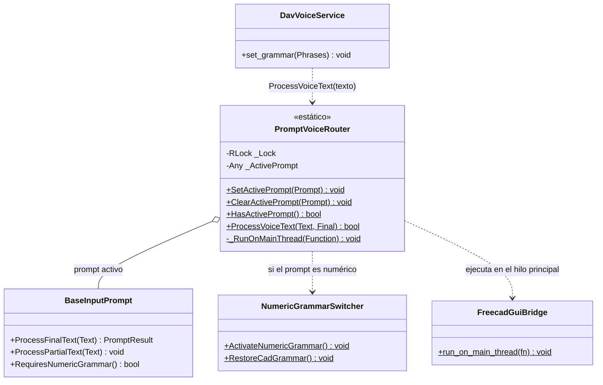

# PromptVoiceRouter

> **Archivo:** `Dav/scr/ComponentesDAV/IntegracionGUI/GUIFreeCad/InputPrompts/PromptVoiceRouter.py`

Registro de **a quién le llega lo que se dice**. Mientras hay un diálogo de voz
abierto, todo lo reconocido va a ese diálogo y **no** al `Browser`: así «cinco»
dentro de un prompt numérico no se interpreta como un comando. Es un registro
global con candado, seguro entre hilos.

## Responsabilidades

| Método | Qué hace |
| --- | --- |
| `SetActivePrompt(Prompt)` | Lo registra; si `RequiresNumericGrammar()` es `True`, cambia la gramática a las palabras de números |
| `ClearActivePrompt(Prompt)` | Lo libera (solo si sigue siendo el activo) y, si era numérico, restaura la gramática de CAD |
| `HasActivePrompt()` | `True` mientras hay un diálogo recibiendo la voz |
| `ProcessVoiceText(Text, Final)` | Entrega la frase (final o parcial) al prompt. Devuelve `True` si la consumió: el motor no la manda al `Browser` |

## Notas de diseño

- **Lo llama `DavVoiceService`, en su hilo del micrófono.** Por eso el prompt se
  ejecuta con `run_on_main_thread`: los widgets de Qt solo se tocan desde el hilo
  principal.
- **Registro y liberación van siempre en `try` / `finally`.** Si un diálogo se
  cerrara sin liberar el registro, el `Browser` quedaría sordo. Todos los helpers
  (`_requestPrompt` en `Workbench/_prompts.py`, `_browse` en Proyecto, `_RequestPromptValue`)
  lo respetan.
- **Solo hay un prompt activo.** Registrar otro reemplaza al anterior.
- **No cambia gramáticas por su cuenta**, salvo la numérica; los prompts con vocabulario
  propio usan [`PlaneGrammarSwitcher`](PlaneGrammarSwitcher.md).
