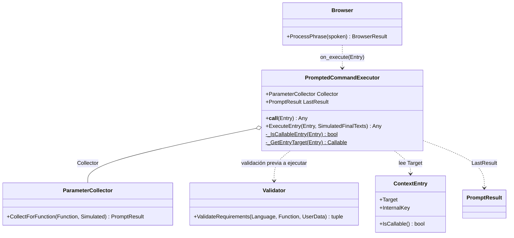
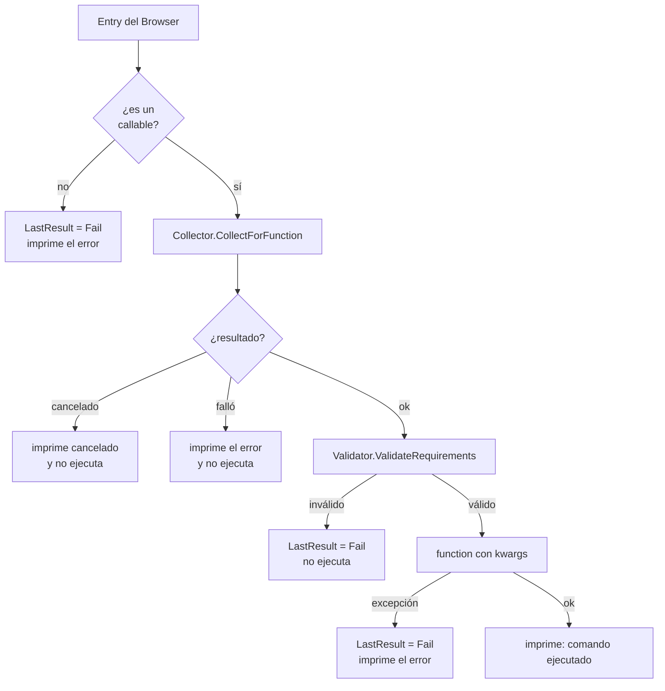

# PromptedCommandExecutor

> **Archivo:** `Dav/scr/ComponentesDAV/IntegracionGUI/GUIFreeCad/InputPrompts/PromptedCommandExecutor.py`

El **ejecutor de comandos** del `Browser`. Se le pasa como `on_execute` y cada vez
que el `Browser` resuelve una frase a una función, se la entrega acá. Si la
función pide parámetros los recolecta por voz; si no, la llama directamente.

## Pasos de `ExecuteEntry`

## Notas de diseño

- **Una función sin parámetros obligatorios no abre ningún diálogo**: el colector
  devuelve `Ok({})` y se llama con `function()`.
- **Los mensajes van a la consola de FreeCAD** (`App.Console.PrintMessage` / `PrintError`)
  y, si FreeCAD no está (tests), a `print`.
- **El `Validator` se aplica dos veces a propósito:** dentro del colector y de nuevo justo
  antes de ejecutar, como capa de verificación previa. Si su integración falla por un
  problema de importación solo avisa y ejecuta con los valores ya recolectados.
- **`LastResult`** deja el último resultado consultable, útil en pruebas.
- Se construye en `integration/voice_bootstrap.py` con el idioma de las preferencias.
