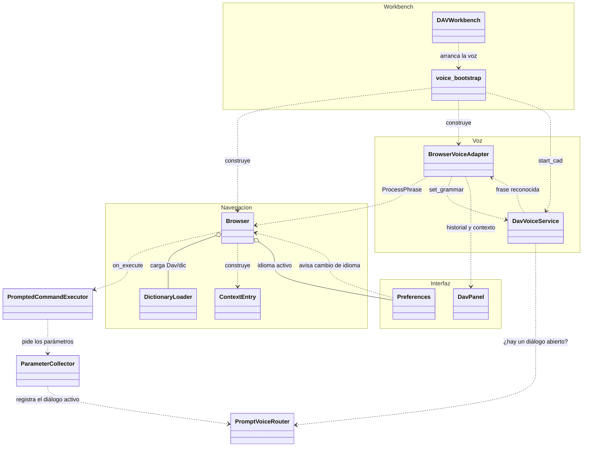
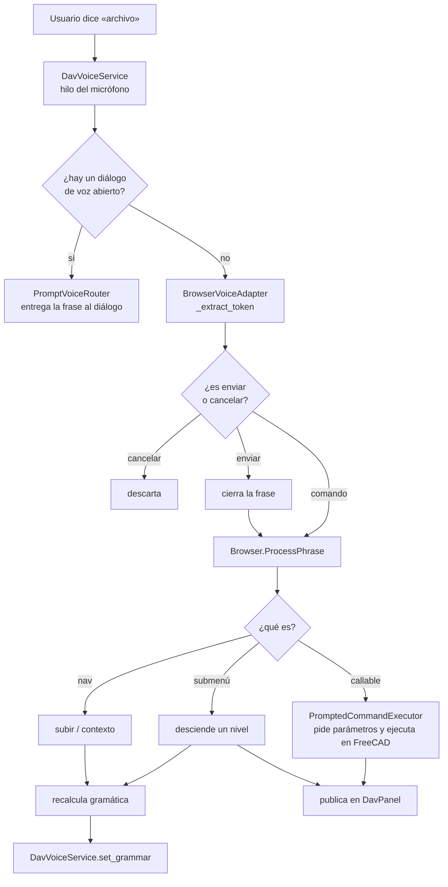

# Diagramas de clases — DAV

Un archivo por clase, con el nombre de la clase. Cada uno tiene el diagrama en
Mermaid, la tabla de responsabilidades y las notas de diseño que no se ven en la
firma de los métodos.

> Antes esto era un único `diagramas_clases_DAV.md`. Se separó y se actualizó:
> documentaba `MainWindow` y `VoiceWorker`, que ya no existen (ver
> [`completados-dav.md`](../completados-dav.md)).

## Motor de navegación

| Clase | Rol |
| --- | --- |
| [`Browser`](Browser.md) | Recorre el árbol de `Dav/dic/` y resuelve cada frase |
| [`ContextEntry`](ContextEntry.md) | Una entrada del contexto: frase → clave → target |
| [`DictionaryLoader`](DictionaryLoader.md) | Carga los módulos del diccionario desde disco |

## Voz

| Clase | Rol |
| --- | --- |
| [`DavVoiceService`](DavVoiceService.md) | Singleton del micrófono y el recognizer Vosk |
| [`BrowserVoiceAdapter`](BrowserVoiceAdapter.md) | Une la voz con el `Browser` y publica al panel |

Cómo se acota la gramática al contexto:
[`acortador-gramatica-vosk.md`](../acortador-gramatica-vosk.md).

## Diálogos de voz (InputPrompts)

Cómo se recolecta un valor por voz, de punta a punta:
[`FlujoComandoConParametros`](FlujoComandoConParametros.md).

### Los diálogos

| Clase | Rol |
| --- | --- |
| [`BaseInputPrompt`](BaseInputPrompt.md) | Ventana base de todos los diálogos: mensaje, estado, texto escuchado y resultado |
| [`NumericInputPrompt`](NumericInputPrompt.md) | Número dictado en varias frases (`IntegerInputPrompt` y `FloatInputPrompt` lo especializan) |
| [`YesNoInputPrompt`](YesNoInputPrompt.md) | Pregunta de sí o no |
| [`ObjectSelectionInputPrompt`](ObjectSelectionInputPrompt.md) | Elige un objeto del documento recorriéndolos |
| [`FileSelectionInputPrompt`](FileSelectionInputPrompt.md) | Navega carpetas y elige un archivo o una carpeta |
| [`PlaneSelectionInputPrompt`](PlaneSelectionInputPrompt.md) | Elige el plano o la cara donde dibujar un croquis |
| [`ChoiceInputPrompt`](ChoiceInputPrompt.md) | Elige una opción entre pocas (p. ej. relieve o perforación) |
| [`SpellingInputPrompt`](SpellingInputPrompt.md) | Arma un texto letra por letra |
| [`ExampleChoiceInputPrompt`](ExampleChoiceInputPrompt.md) | Elige un ejemplo guiado con retroceder / avanzar / enviar |
| [`GuidedExampleInputPrompt`](GuidedExampleInputPrompt.md) | Reproduce un ejemplo cuadro por cuadro (no modal) |
| [`ExampleStep`](ExampleStep.md) | Un cuadro: texto, palabras a decir y acción |

### Lo que los hace funcionar

| Clase | Rol |
| --- | --- |
| [`PromptedCommandExecutor`](PromptedCommandExecutor.md) | Ejecuta el comando que resolvió el `Browser`, recolectando antes sus parámetros |
| [`ParameterCollector`](ParameterCollector.md) | Pide cada parámetro con el diálogo que corresponde a su tipo |
| [`PromptVoiceRouter`](PromptVoiceRouter.md) | Registro de qué diálogo recibe lo que se dice |
| [`PlaneGrammarSwitcher`](PlaneGrammarSwitcher.md) | Acota la gramática de Vosk a las palabras de un diálogo |
| [`NumericGrammarSwitcher`](NumericGrammarSwitcher.md) | Cambia la gramática a la de dictado de números |
| [`SpokenNumberParser`](SpokenNumberParser.md) | Convierte frases dictadas en números; palabras de confirmar y cancelar |

Uso completo: [`manual-croquis-y-grabado-voz.md`](../manual-croquis-y-grabado-voz.md).

## Validación y selección

| Clase | Rol |
| --- | --- |
| [`Validator`](Validator.md) | Inspecciona una función y valida y convierte los datos que se le dan |
| [`CreateObjects`](CreateObjects.md) | Extrae caras, aristas, líneas y puntos de una figura y los nombra con `Tagger` |

## Diccionario

| Carpeta | Rol |
| --- | --- |
| [`Examples`](Examples.md) | Submenú del Explorer: manual de usuario y ejemplos guiados |

Cómo está organizado el árbol completo: [`Dav/dic/CONTEXT.md`](../../dic/CONTEXT.md).

## Interfaz y configuración

| Clase | Rol |
| --- | --- |
| [`DavPanel`](DavPanel.md) | El widget acoplado dentro de FreeCAD |
| [`Preferences`](Preferences.md) | Idioma activo y persistencia de la configuración |
| [`DAVWorkbench`](DAVWorkbench.md) | Workbench de FreeCAD y comandos de la barra |
| [`Keychain`](Keychain.md) | Lee diccionarios `.py` sin ejecutarlos |
| [`IconLocator`](IconLocator.md) | Encuentra el SVG de cada clave para los botones del panel |
| [`LaunchPreferences`](LaunchPreferences.md) | Abre las Preferencias y aplica el tema y la voz al cerrarlas |
| [`FreecadGuiBridge`](FreecadGuiBridge.md) | Pasa funciones del hilo de voz al hilo principal de Qt |
| [`VoiceHistory`](VoiceHistory.md) | Historial de frases y estado del motor, compartidos con el panel |
| [`ModelManager`](ModelManager.md) | Verifica y descarga los modelos de Vosk |

---

## Vista general

Cómo se conectan las piezas cuando el usuario dice algo.

## El recorrido de una frase

El detalle de los comandos con parámetros está en [`FlujoComandoConParametros`](FlujoComandoConParametros.md).

