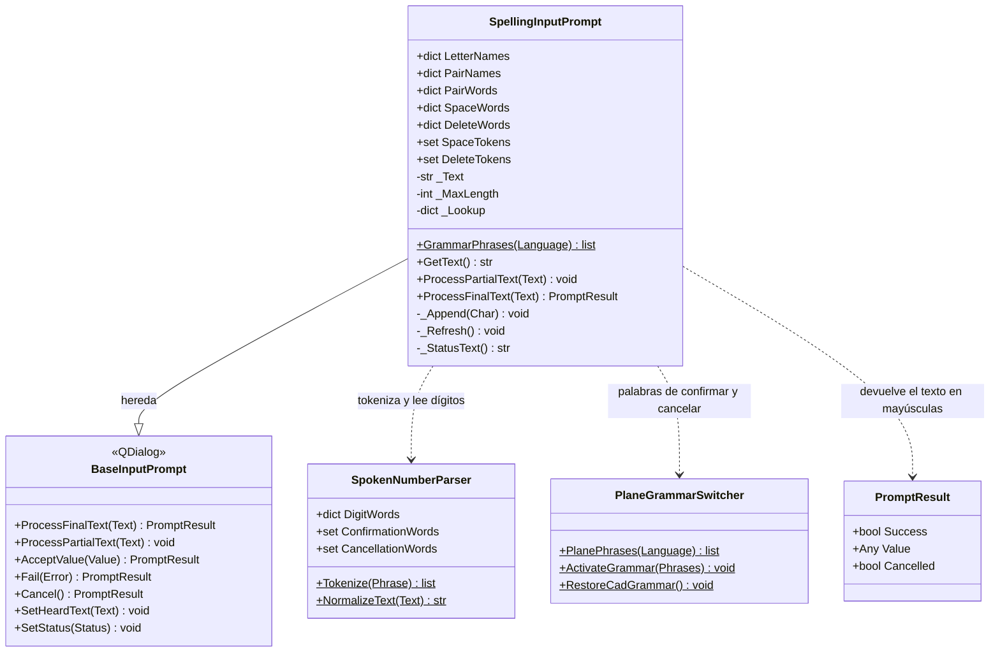
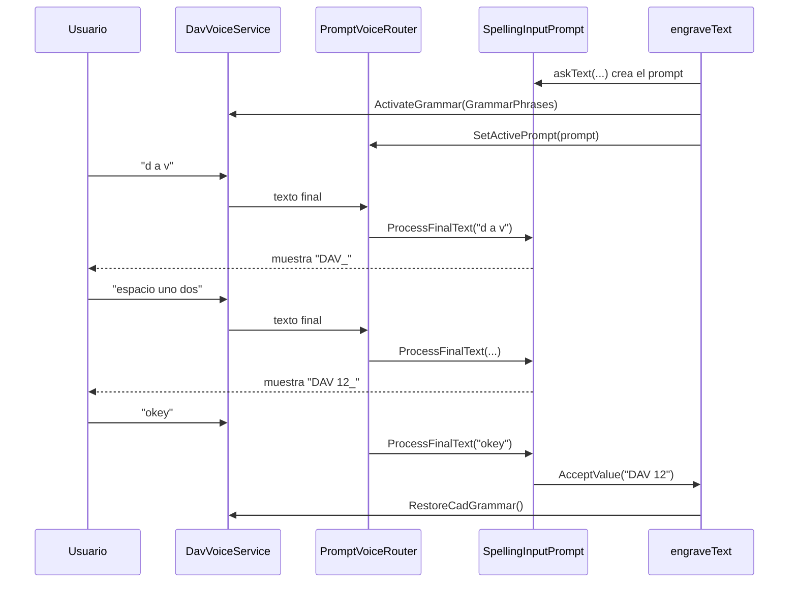

# SpellingInputPrompt

> **Archivo:** `Dav/scr/ComponentesDAV/IntegracionGUI/GUIFreeCad/InputPrompts/SpellingInputPrompt.py`

Diálogo de voz que arma un texto **letra por letra**. Lo usa el comando
`grabar` para pedir el texto a grabar (ver
[`manual-croquis-y-grabado-voz.md`](../manual-croquis-y-grabado-voz.md)). El
usuario dice el nombre de cada letra, dígitos, `espacio`, `borrar` y `okey`.

## Responsabilidades

| Método | Qué hace |
| --- | --- |
| `ProcessFinalText(Text)` | Recorre las palabras de la frase: aplica letras, dígitos, `espacio` y `borrar`; corta en la primera palabra de confirmación (`okey`…) y acepta el texto. Una palabra de cancelación aborta todo |
| `GrammarPhrases(Language)` | Palabras que Vosk debe escuchar mientras se deletrea: nombres de letra del idioma, dígitos, `espacio`, `borrar`, confirmación y cancelación (sin `arriba`/`abajo`) |
| `GetText()` | Texto armado hasta ahora |
| `ProcessPartialText(Text)` | Ignora los parciales: una letra solo cuenta cuando llega el resultado final |

## Recorrido de una frase

## Notas de diseño

- **Gramática acotada.** Con el vocabulario abierto de un modelo pequeño, las
  letras sueltas se confunden con cualquier palabra. Por eso, mientras el prompt
  está activo, Vosk solo escucha las palabras de `GrammarPhrases`.
- **Un idioma en la gramática, tres al parsear.** La gramática lista solo los
  nombres de letra del idioma activo, pero `_Lookup` junta los tres idiomas: si
  el usuario dice una letra en otro idioma, se entiende igual.
- **Las tablas solo tienen palabras que Vosk conoce.** Se comprobaron contra el
  vocabulario de los modelos pequeños. Lo que falta se dice de otra forma: en
  portugués `fê`, `n` y `duplo vê` (F, N y W); en español la `ñ` se acepta como
  `ñ` suelta o `eñe`, aunque el modelo pequeño solo conoce la primera.
- **Letras de dos palabras** (`doble uve`, `i griega`) se resuelven mirando la
  palabra siguiente antes de interpretar la primera; `i` sola es la letra I.
- **La Ñ se protege antes de normalizar.** `SpokenNumberParser.NormalizeText`
  quita las tildes y `ñ` quedaría como `n`, así que `eñe` y `ñ` se reemplazan por
  un marcador interno antes de tokenizar.
- **Letras sueltas.** Vosk a veces devuelve la letra pelada (`d`, `v`); se acepta
  cualquier carácter alfabético de una sola letra.
- **Solo dígitos sueltos.** Se usan las entradas de `DigitWords` de un carácter;
  `veinticuatro` o `diez` no se reconocen y se ignoran sin avisar.
- **Salida en mayúsculas**, con un máximo de 40 caracteres (`MaxLength`).
