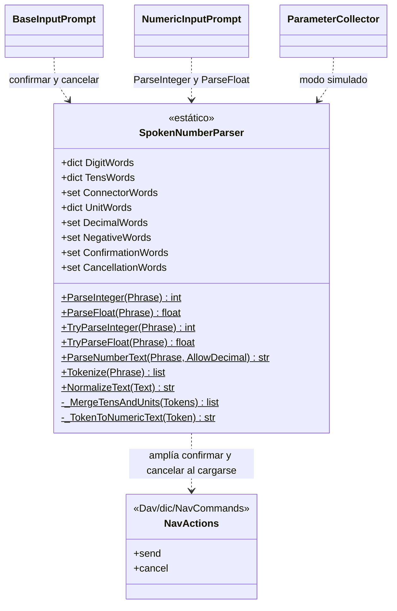
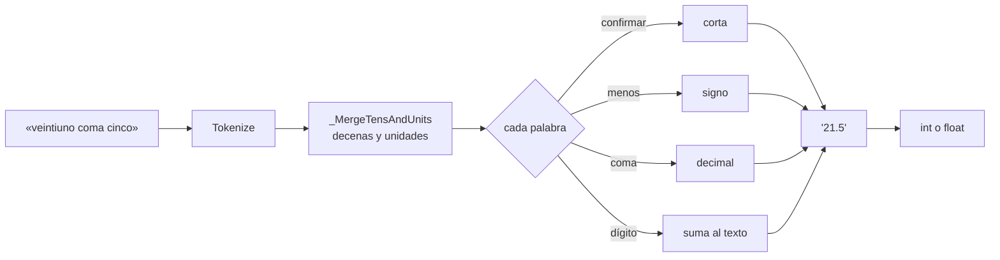

# SpokenNumberParser

> **Archivo:** `Dav/scr/ComponentesDAV/IntegracionGUI/GUIFreeCad/InputPrompts/SpokenNumberParser.py`

Convierte **frases dictadas en números** («veintiuno coma cinco» → `21.5`) y ofrece
las herramientas de texto que usan todos los prompts: normalizar sin tildes,
tokenizar y las palabras de confirmar y cancelar. Es una clase de solo métodos
de clase, sin estado por instancia.

## Responsabilidades

| Método | Qué hace |
| --- | --- |
| `NormalizeText(Text)` | Minúsculas, sin tildes ni eñes; la coma pasa a punto decimal |
| `Tokenize(Phrase)` | Normaliza y separa en palabras y números |
| `ParseNumberText(Phrase, AllowDecimal)` | Arma el número como texto: dígitos, signo (`menos`) y separador decimal (`coma`, `punto`) |
| `ParseInteger` / `ParseFloat` | Convierten a `int` / `float`; lanzan `ValueError` si la frase no es un número |
| `TryParseInteger` / `TryParseFloat` | Igual, pero devuelven `None` en vez de lanzar |

## Cómo se lee un número

## Notas de diseño

- **Tres idiomas en una sola tabla.** Las palabras de cualquier idioma se aceptan a la
  vez; no hace falta saber en qué idioma se dictó.
- **Confirmar y cancelar se amplían al importar el módulo.** `_LoadNavWordsFromDictionaries`
  suma las frases de `NavCommands/TraduceTo*.py` que apuntan a `send` y `cancel`. Así, un
  sinónimo nuevo agregado al diccionario funciona en todos los prompts sin tocar código.
  Si el diccionario no está, quedan las palabras básicas escritas en la clase.
- **`ConnectorWords`** («y» / «e») une decenas y unidades: «treinta y cinco».
- Límites y propuesta de mejora del dictado numérico:
  [`numeros-por-voz-limites-y-propuesta.md`](../numeros-por-voz-limites-y-propuesta.md).
