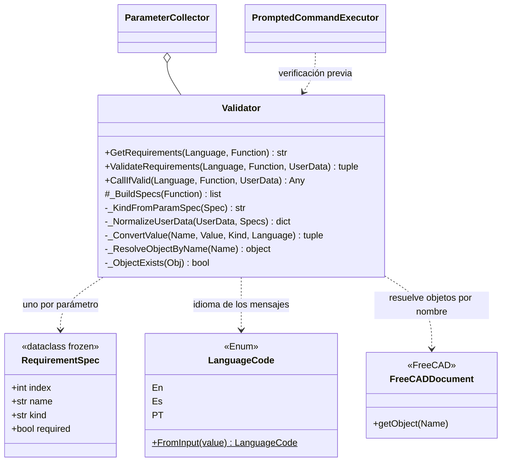

# Validator

> **Archivo:** `Dav/scr/validation/validator.py`

Inspecciona una función del diccionario y **valida los valores que se le van a
dar**: qué parámetros pide, de qué tipo y si son obligatorios; después convierte los
datos del usuario a esos tipos. Los mensajes salen en el idioma activo. No depende de
la voz: recibe datos y devuelve datos.

## Tipos soportados

| `kind` | Se espera | Origen |
| --- | --- | --- |
| `int` | Un entero | anotación `int` |
| `float` | Un número decimal | anotación `float` |
| `str` | Un texto | anotación `str` |
| `object` | Un objeto del documento | cualquier otra anotación o ninguna |

## Responsabilidades

| Método | Qué hace |
| --- | --- |
| `GetRequirements(Language, Function)` | Imprime y devuelve una línea por parámetro («Dato1: se espera un entero») |
| `ValidateRequirements(...)` | Convierte los datos. Si falta un obligatorio o un tipo no coincide, **imprime** los errores y devuelve `(False, None)`; si no, `(True, kwargs)` |
| `CallIfValid(...)` | Valida y llama a `Function(**kwargs)`; devuelve `None` si no valida |
| `_BuildSpecs(Function)` | Lee `Function._param_specs` si existe; si no, la firma con `inspect` (ignora `*args` y `**kwargs`) |
| `_NormalizeUserData` | Acepta un `dict` por nombre o una lista posicional |
| `_ConvertValue` | Convierte al tipo pedido o devuelve un error localizado |
| `_ResolveObjectByName` | Para `object`, busca el objeto por nombre en el documento activo |

## Notas de diseño

- **Un parámetro con valor por defecto es opcional** (`required=False`) y no se pide por voz.
- **Errores localizados** en los tres idiomas: falta el parámetro, tipo incorrecto, objeto
  inexistente, sin documento activo, no se pudo convertir.
- **No abre diálogos ni escucha:** eso es de [`ParameterCollector`](ParameterCollector.md).
  Por eso se puede probar solo (`validation/run_tests.py`, `test_validator.py`).
- Documentación de pruebas: `Dav/scr/validation/docs/`.
