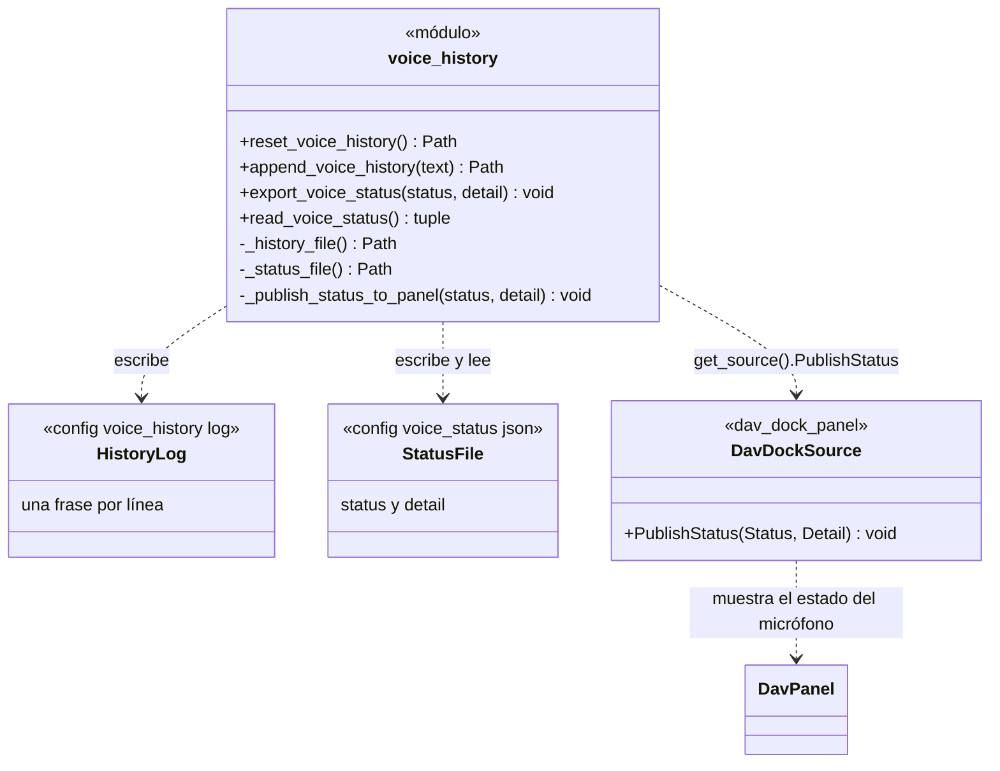

# VoiceHistory

> **Archivo:** `Dav/scr/ComponentesDAV/IntegracionGUI/GUIFreeCad/integration/voice_history.py`

Módulo de funciones que guarda dos cosas **compartidas entre el motor de voz y la
interfaz**: el historial de frases dichas y el estado del motor (escuchando,
inactivo, error…). Son archivos en la carpeta `config/`, así cualquier parte del
programa puede leerlos sin conocerse entre sí.

## Responsabilidades

| Función | Qué hace |
| --- | --- |
| `reset_voice_history()` | Vacía el historial (al iniciar una sesión de voz) |
| `append_voice_history(text)` | Agrega una línea al final |
| `export_voice_status(status, detail)` | Escribe el estado en JSON y lo **publica al panel** |
| `read_voice_status()` | Lee el estado; devuelve `("inactive", ...)` si no existe el archivo o está roto |

## Notas de diseño

- **`export_voice_status` es el único punto por el que pasa todo cambio de estado**, así
  que ahí se avisa al panel. El cartel del micrófono no depende de que alguien se
  acuerde de notificarlo.
- **Publicar al panel nunca falla el motor:** si el panel no está montado o lanza un
  error, se ignora.
- **La carpeta `config/`** se busca subiendo por los ancestros del archivo; si no aparece,
  se crea junto a `integration/`.
- **Quién escribe:** [`BrowserVoiceAdapter`](BrowserVoiceAdapter.md) agrega cada frase y
  su resultado con `append_voice_history`; `voice_bootstrap.py` reinicia el historial al
  arrancar la voz y exporta los estados (`active`, `error`…).
