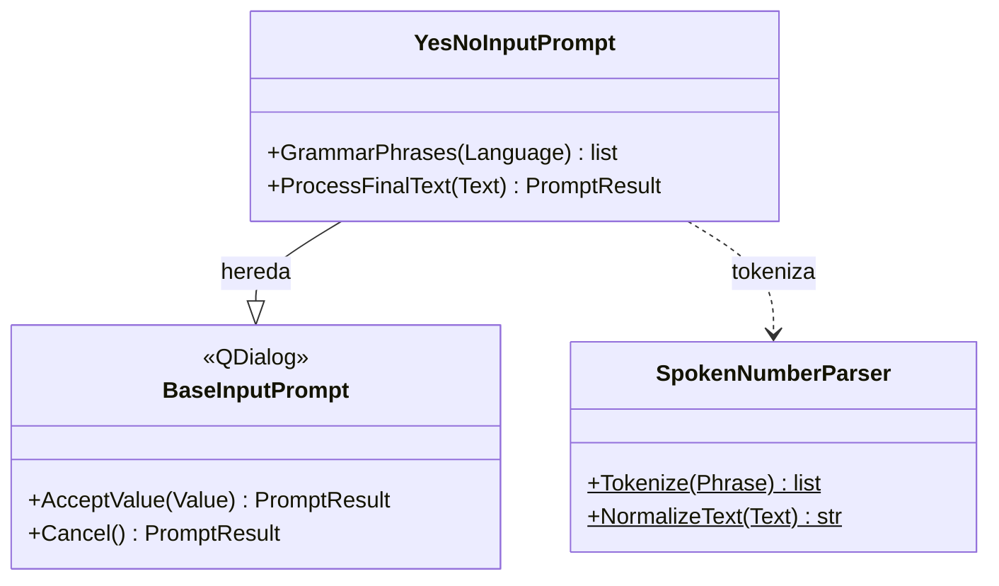

# YesNoInputPrompt

> **Archivo:** `Dav/scr/ComponentesDAV/IntegracionGUI/GUIFreeCad/InputPrompts/YesNoInputPrompt.py`

Pregunta que se responde con **sí** o **no**. El valor aceptado es `True` o `False`.
Para salir sin contestar se dice *cancelar*: `no` es una respuesta, no una
cancelación. Se abre con `askYesNo` (`Workbench/_prompts.py`); por ejemplo, `Correction`
lo usa para confirmar antes de borrar.

## Palabras

| Respuesta | es | en | pt |
| --- | --- | --- | --- |
| Sí (`True`) | si, okey, ok, dale, aceptar, confirmar, listo, vale | yes, yep, okey, ok, accept, confirm | sim, okey, ok, aceitar, confirmar, pronto |
| No (`False`) | no, negativo | no, nope, negative | não, negativo |
| Cancelar | cancelar, cancela, abortar, anular, descartar | cancel, abort, discard | cancelar, cancelamento, abortar, anular |

Se comparan sin tildes y en los tres idiomas a la vez; la gramática de Vosk se acota
al idioma activo con `GrammarPhrases`.

## Notas de diseño

- **Orden de evaluación:** cancelar, luego no, luego sí. Así una frase con «no» y
  «okey» cuenta como *no*.
- **El botón *Aceptar* de la ventana responde «sí»**: se reemplaza el del prompt base,
  que devolvería el texto escuchado.
- Una frase que no coincide con nada solo actualiza el estado («No te entendí»), sin
  cerrar el diálogo.
