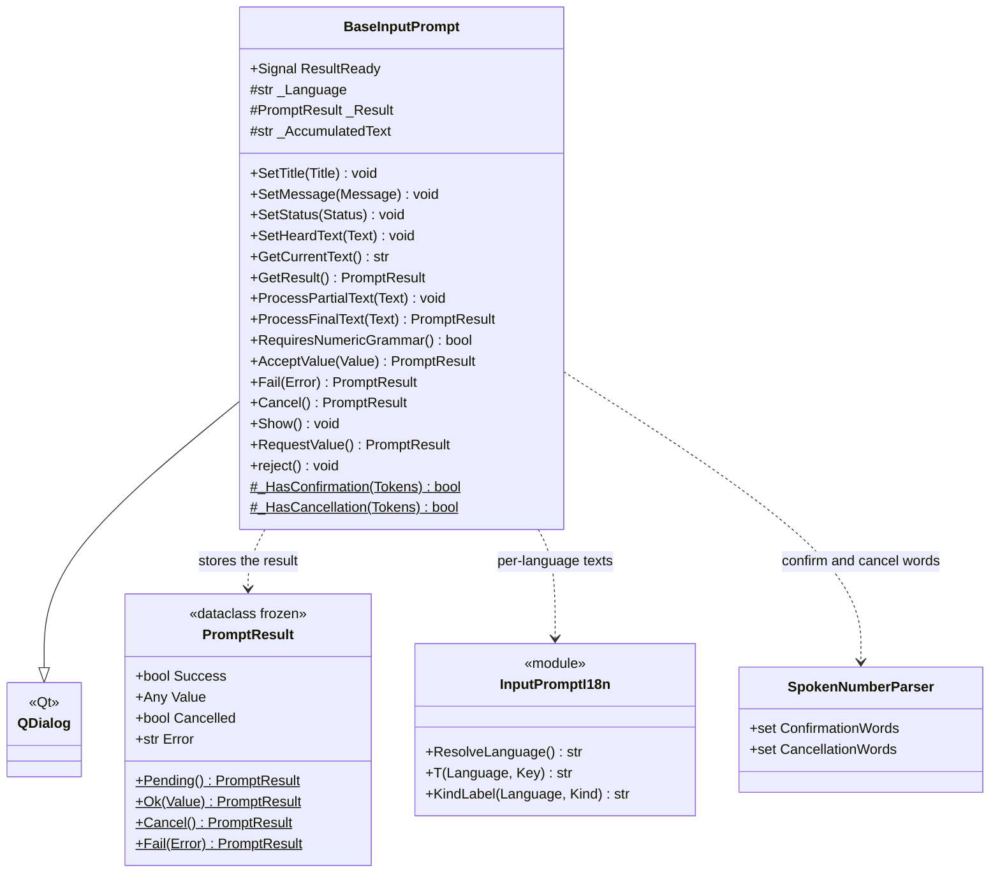
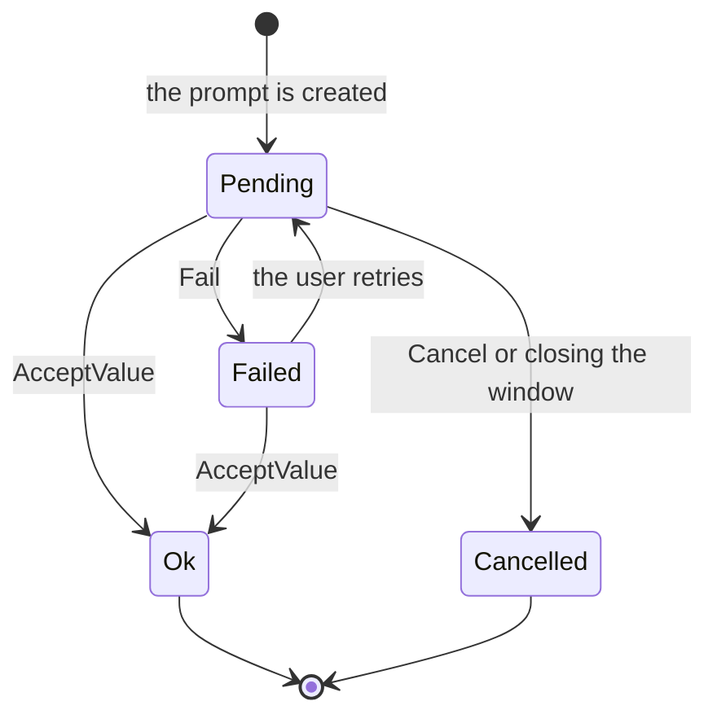

# BaseInputPrompt

> **File:** `Dav/scr/ComponentesDAV/IntegracionGUI/GUIFreeCad/InputPrompts/BaseInputPrompt.py`

Base class of all voice dialogs. It is a `QDialog` with a message, a status line,
the text that was heard and the *Accept* / *Cancel* buttons. It does not know
what the user is being asked for: each subclass decides what to do with what it hears
(`ProcessFinalText`) and when to accept the value (`AcceptValue`).

## Responsibilities

| Method | What it does |
| --- | --- |
| `ProcessFinalText(Text)` | Extension point: the base class only displays the text. Subclasses override it |
| `ProcessPartialText(Text)` | Shows what is being recognized while the user speaks |
| `AcceptValue(Value)` | Stores `PromptResult.Ok`, emits `ResultReady` and closes. Rejects empty text |
| `Fail(Error)` | Stores the error and **leaves the dialog open** so the user can retry |
| `Cancel()` | Stores the cancelled result and closes |
| `RequestValue()` | Shows it **modally** (`exec`) and returns the result when it closes |
| `Show()` | Shows it without blocking (used by [`GuidedExampleInputPrompt`](GuidedExampleInputPrompt.md)) |
| `RequiresNumericGrammar()` | `False` by default; numeric prompts return `True` so the router switches the grammar |
| `reject()` | Closing the window counts as cancelling |

## Result states

## Design notes

- **Light or dark theme.** `_IsDarkTheme()` reads FreeCAD's theme preference (its Qt
  palette stays light even with the dark theme) and only looks at the palette if
  the preference says nothing. Black text on light, red on dark.
- **The language is read when the prompt is created** with `ResolveLanguage()`, the same source
  used by the `Browser` and the `Tagger`.
- **PySide6 first, PySide2 as a fallback**, like the rest of the GUI.
- **Subclasses:** [`FileSelectionInputPrompt`](FileSelectionInputPrompt.md),
  [`ObjectSelectionInputPrompt`](ObjectSelectionInputPrompt.md),
  [`NumericInputPrompt`](NumericInputPrompt.md), [`YesNoInputPrompt`](YesNoInputPrompt.md),
  [`ChoiceInputPrompt`](ChoiceInputPrompt.md), [`PlaneSelectionInputPrompt`](PlaneSelectionInputPrompt.md),
  [`SpellingInputPrompt`](SpellingInputPrompt.md), `StringInputPrompt` and
  [`GuidedExampleInputPrompt`](GuidedExampleInputPrompt.md).
