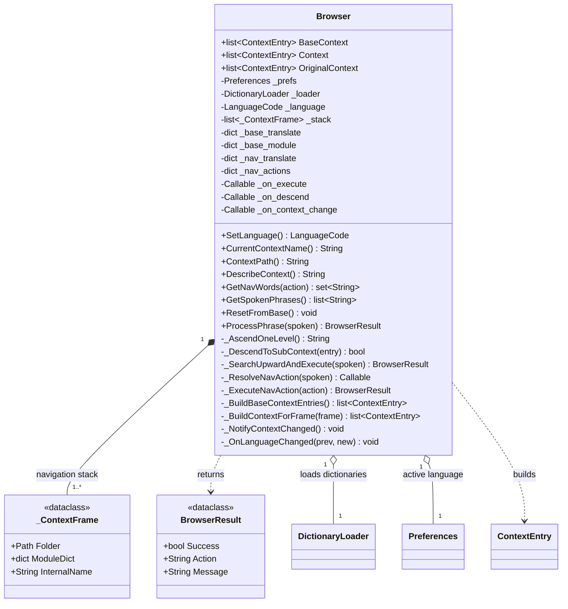

# Browser

> **File:** `Dav/scr/ComponentesDAV/IntegracionGUI/GUIFreeCad/navigation/browser.py`

Navigation engine for the voice command tree. It walks through `Dav/dic/`
keeping a stack of contexts: each recognized phrase is resolved against the
current level, and if it is a submenu the browser descends into it.

It is the `DAVAgent` of the original conceptual design, with a different name and a
different implementation: `ProcessPhrase` + `DictionaryLoader` instead of
`latentListening` + `searchInstruction`.

## Responsibilities

| Method | What it does |
| --- | --- |
| `ProcessPhrase(spoken)` | Entry point. Resolves a phrase against the active context: navigation command, jump to root, descent into a submenu, execution, or upward search |
| `GetSpokenPhrases()` | Vosk grammar for the active level. See [`vosk-grammar-shortener.md`](../vosk-grammar-shortener.md) |
| `GetNavWords(action)` | Words bound to a `NavCommands` sentinel (`up`, `send`, `cancel`, `show_context`) in the active language |
| `DescribeContext()` | Human-readable text of where the user is standing and what they can say |
| `ResetFromBase()` | Reloads everything from `base.py`. Triggered when the language changes |

## Design notes

- **It does not know FreeCAD.** It executes callables that come from the dictionaries; who
  provides them is the `DictionaryLoader`'s concern.
- **One language at a time.** `_OnLanguageChanged` is registered in `Preferences`,
  so changing the language rebuilds the contexts.
- `_on_context_change` notifies whoever needs to recompute the voice grammar.
  Currently `BrowserVoiceAdapter` uses it.
