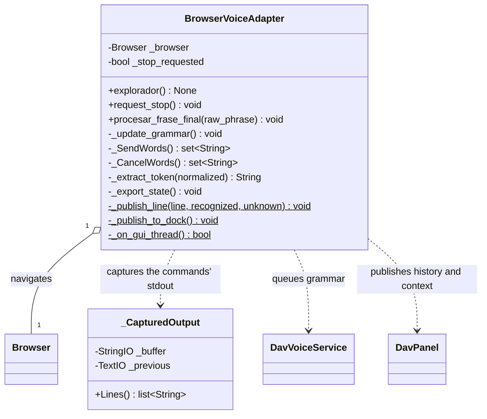
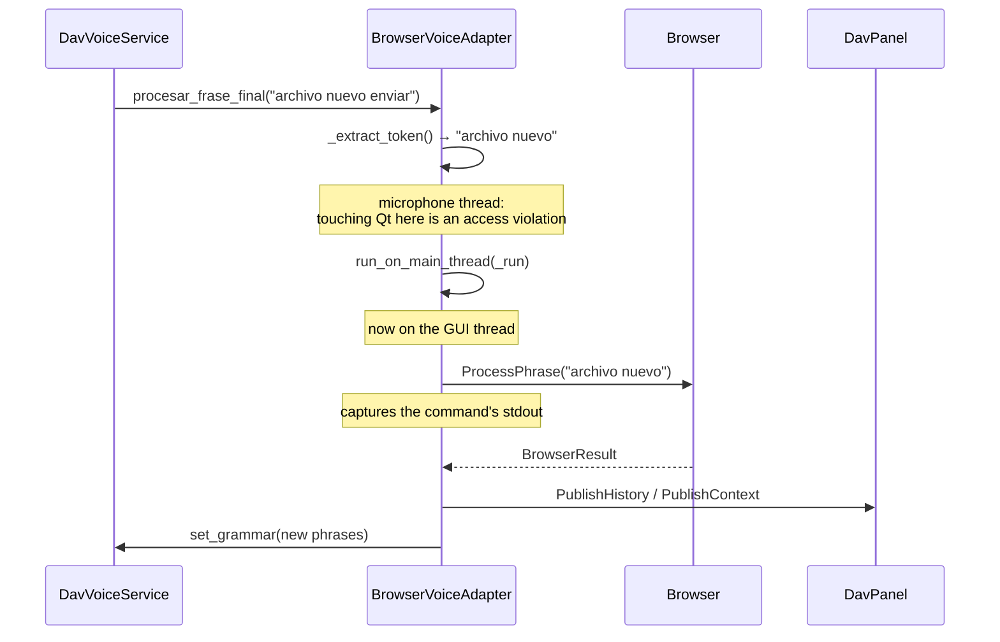

# BrowserVoiceAdapter

> **File:** `Dav/scr/ComponentesDAV/IntegracionGUI/GUIFreeCad/integration/browser_voice_adapter.py`

Connects the voice engine to the `Browser`. It receives the raw phrase recognized by Vosk,
cleans it, sends it to navigate, and publishes the result in the DAV panel.

## The flow of a phrase

(The phrase `"archivo nuevo enviar"` is spoken Spanish: "new file send".)

## Why `_CapturedOutput` exists

The dictionary commands (the `ayuda.py` files above all) write their output
with `print`: there are **988 calls spread across 123 files**. In FreeCAD that goes
to the Report View, not to the DAV panel.

Instead of touching every command, `sys.stdout` is captured while the command runs
and then dumped into the panel. It restores `sys.stdout` even if the command raises.

## Design notes

- **`procesar_frase_final` runs on the microphone thread.** Touching a Qt widget
  from there is an access violation: it crashes the process without going through any
  `except`. That is why everything that reaches the GUI goes inside
  `run_on_main_thread`, and `_on_gui_thread()` checks before publishing.
- **`_SendWords()` / `_CancelWords()` come from the dictionary**
  (`Browser.GetNavWords`), not from constants. The `_SEND_WORDS` and
  `_CANCEL_WORDS` constants remain only as a fallback in case `NavCommands` fails to load.
- `_extract_token` strips the trailing `enviar` ("send") from "archivo nuevo enviar" and returns
  `False` if the phrase ends in a cancel word.
