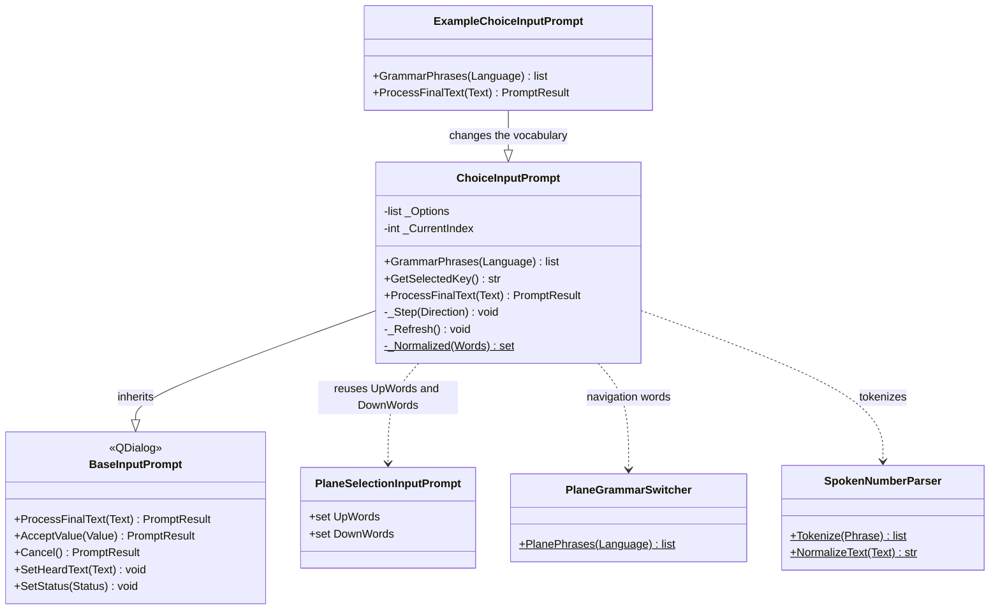

# ChoiceInputPrompt

> **File:** `Dav/scr/ComponentesDAV/IntegracionGUI/GUIFreeCad/InputPrompts/ChoiceInputPrompt.py`

Voice dialog for choosing **one option among a few** named ones. It works like
the plane selector ([`PlaneSelectionInputPrompt`](PlaneSelectionInputPrompt.md)):
`arriba` (up) / `abajo` (down) move the selection and `okey` confirms. In addition, saying the name
of an option picks it **immediately**. It is used by `grabar` (engrave) to choose between
*relieve* (emboss) and *perforación* (engrave/cut-in).



## Responsibilities

| Method | What it does |
| --- | --- |
| `ProcessFinalText(Text)` | Cancel aborts; naming an option accepts it instantly; `abajo`/`arriba` move; a confirmation word accepts the highlighted option |
| `GrammarPhrases(Language)` | Vosk grammar: navigation, confirm, cancel and the words of each option |
| `GetSelectedKey()` | Key of the highlighted option |

## How it is assembled

`Options` is a list of three values per option: `(key, visible text, words
that select it)`. The prompt returns the **key**.

```python
askChoice("Grabar texto", "¿Relieve o perforación?", [
    ("emboss",  "Relieve (sobresale)",   ("relieve", "saliente", "relief")),
    ("engrave", "Perforación (hundido)", ("perforación", "hundido", "grabado")),
])
```

(The strings are the Spanish dialog title, question and spoken words: "Engrave text", "Emboss or engrave?", "Emboss (protrudes)", "Engrave (sunken)".)

It is created from `askChoice` in
[`_prompts.py`](../../../dic/Workbench/_prompts.py), which also narrows the Vosk
grammar while the dialog is open and restores it when it finishes.

## Design notes

- **Naming beats navigating.** The option-word lookup happens before the
  `arriba`/`abajo` one, so an option whose name matched a navigation word
  would be chosen directly.
- **Compared without accents.** Each option's words are normalized the same way as
  what is heard (`perforación` = `perforacion`), but they go to the Vosk grammar in
  the form used by the model's vocabulary, accents included.
- **No global state.** Everything it knows comes in `Options`, so it works for
  any short choice and not just for engraving.
- **It has a subclass.** [`ExampleChoiceInputPrompt`](ExampleChoiceInputPrompt.md)
  reuses `_Step` and `GetSelectedKey`, but navigates with *retroceder* (back) / *avanzar* (forward) and
  chooses with *enviar* (send).
