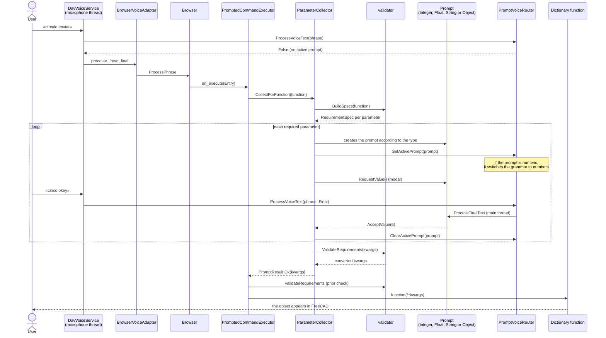
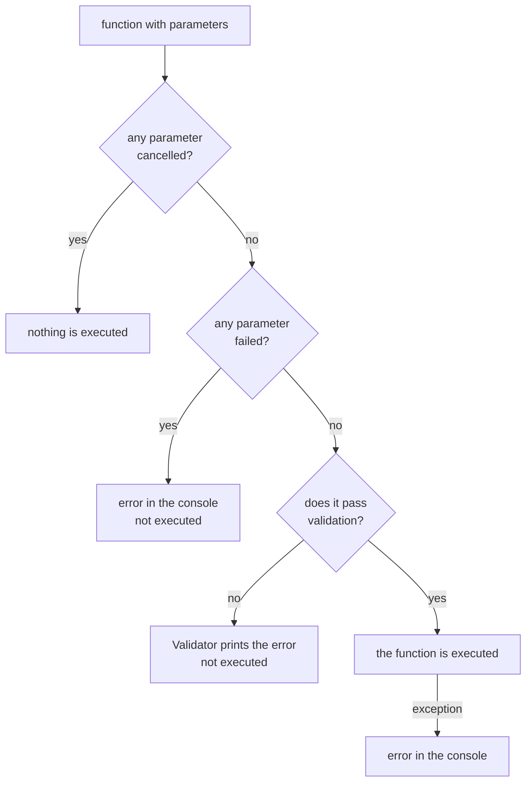

# Flow of a command with parameters

What happens from the moment the user says a command that needs values (for example
"círculo" (circle), which asks for a radius) until the function runs in FreeCAD. It brings together
[`Browser`](Browser.md), [`PromptedCommandExecutor`](PromptedCommandExecutor.md),
[`ParameterCollector`](ParameterCollector.md), [`Validator`](Validator.md), the
voice dialogs and [`PromptVoiceRouter`](PromptVoiceRouter.md).

## Sequence

(Spoken Spanish: «círculo enviar» = "circle send"; «cinco okey» = "five okay".)

## What can cut the flow short

## Points to keep in mind

- **While a prompt is active, the `Browser` does not listen.** The router consumes the phrases
  (`ProcessVoiceText` returns `True`), which is why the registration is always released in a
  `finally`.
- **The dialog texts are resolved with the current language**, not the startup one
  (see the `Language` property of `ParameterCollector`).
- **The types come from the function's signature.** An `int` annotation opens an integer
  numeric prompt, `float` a decimal one, `str` a text one and anything else an
  object-selection one. Parameters with a default value are **not asked for**.
- **Other dialogs do not go through here.** Commands that build their own conversation
  (choosing a plane, opening a file, a guided example) directly open their own prompt
  with the helpers in `Workbench/_prompts.py`; see
  [`guia-contribuir-dav.md`](../dav-development-guide.md).
- **Testing without a microphone:** `ExecuteEntry(Entry, SimulatedFinalTexts=["cinco okey"])`.
