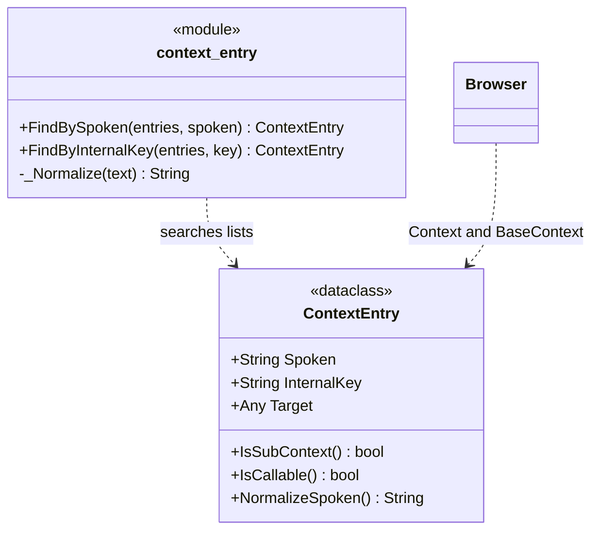

# ContextEntry

> **File:** `Dav/scr/ComponentesDAV/IntegracionGUI/GUIFreeCad/navigation/context_entry.py`

An entry of the navigation context: it links a spoken phrase to an internal key and
to what has to be executed. It is the unit the `Browser` works with.

## The two kinds of entry

The `Target` decides what the entry is:

| `Target` | `IsSubContext()` | `IsCallable()` | What happens when it is said |
| --- | --- | --- | --- |
| `dict` | `True` | `False` | It descends one level |
| callable | `False` | `True` | The FreeCAD command is executed |

That distinction is what makes the tree navigable, and it is also the reason for the
nested-subcontext rule: if a submenu is merged with `.update()` instead of
going under its own key, its leaves end up loose in the parent level and the folder
disappears from the tree. See `pendientes-dav.md` §4.

## Design notes

- **`Spoken` and `InternalKey` are different on purpose.** `Spoken` is what
  the user says ("explorador"); `InternalKey` is the key in the base dictionary
  (`explorer`). Both go into the Vosk grammar.
- **Lookup is by normalized phrase**, not by exact equality: `_Normalize`
  strips accents, lowercases and collapses spaces, so "dónde estoy" and "donde
  estoy" resolve the same way.
