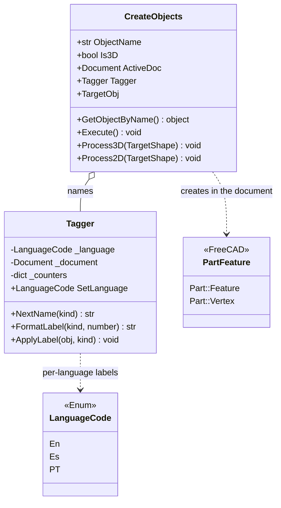

# CreateObjects

> **File:** `Dav/scr/selection/createobjects.py` (uses `tagger.py`)

Extracts **the sub-elements of an existing shape** and turns them into
objects of their own in the document, with sequential names in the active language. From a solid
it extracts faces and edges; from a flat shape, lines and points. The names are assigned by
[`Tagger`](#tagger): `Superficie1`, `Linea2`, `Punto3`... (Spanish names; "Surface", "Line", "Point")

## What `Execute()` creates

| Mode | Input | Output |
| --- | --- | --- |
| `Is3D=True` (`Process3D`) | A solid | One `Part::Feature` per **face** (`surface`) and another per **edge** (`edge`) |
| `Is3D=False` (`Process2D`) | A flat shape | One `Part::Feature` per edge (`line`) and one `Part::Vertex` per **unique vertex** (`point`) |

At the end it recomputes the document. Repeated vertices are discarded by comparing the
position rounded to 4 decimals.

## Tagger

| Method | What it does |
| --- | --- |
| `NextName(kind)` | Unique name for `Name` (`Linea1`, `Linea2`...). Skips those that already exist in the document |
| `FormatLabel(kind, number)` | Text for the tree: "Superficie 3" |
| `ApplyLabel(obj, kind)` | Sets `obj.Label` with the current counter |

Valid kinds: `point`, `line`, `surface`, `edge`. Any other kind raises `ValueError`.

## Design notes

- **`Name` without spaces, `Label` with a space.** `Name` is FreeCAD's internal
  identifier (`Linea1`); `Label` is what the user sees (`Linea 1`).
- **The `Tagger` can be injected** (`TaggerInstance`) to share counters across
  several extractions or for testing.
- **Errors via console, not exceptions:** with no document, a nonexistent object or an object without
  `Shape`, it prints the reason and `Execute()` does nothing.
- Status of the integration of `selection/` into the program and what is still to be decided:
  `pendientes-dav.md` §12.
