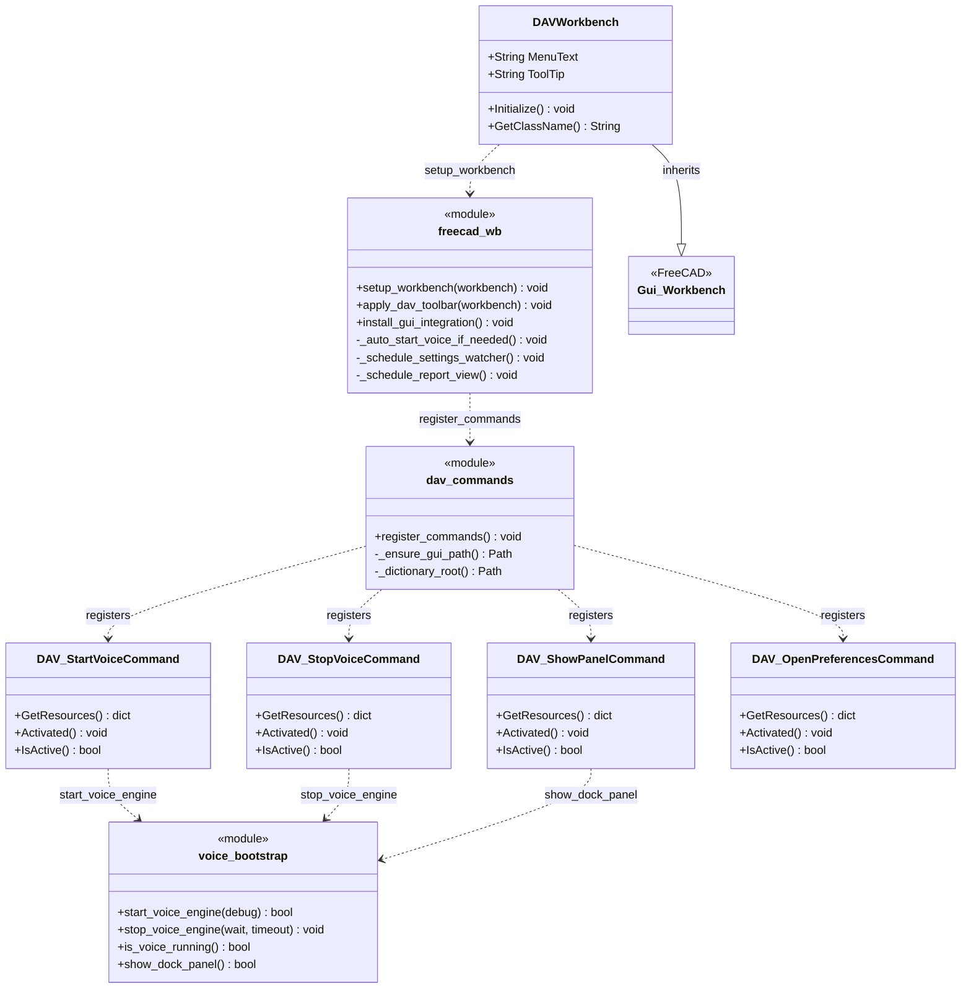
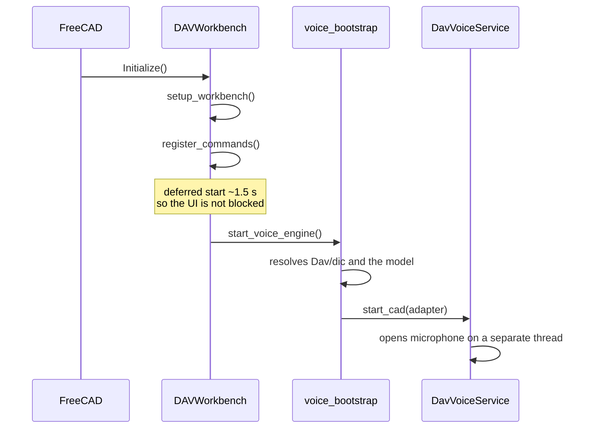

# DAVWorkbench and commands

> **Files:**
> `Dav/scr/ComponentesDAV/Dav/InitGui.py`
> `Dav/scr/ComponentesDAV/Dav/scr/gui/dav_commands.py`
> `Dav/scr/ComponentesDAV/Dav/scr/gui/freecad_wb.py`

The workbench that FreeCAD loads at startup. It registers the commands of the DAV
toolbar and starts the voice engine.

## Startup

## Design notes

- **Several places call `start_voice_engine`** (the toolbar command,
  the workbench when it is activated, `freecad_voice_setup`): the log shows about four
  calls per startup. They do not step on each other (they are separated in time and
  `is_cad_engine_loaded()` stops them), so only the first one opens the microphone. That is why
  startup is logged at `debug` level.
- The `[DAV]` messages go to FreeCAD's **Report view** tab, not to the Python
  console. The real log is in `config/dav.log`.
