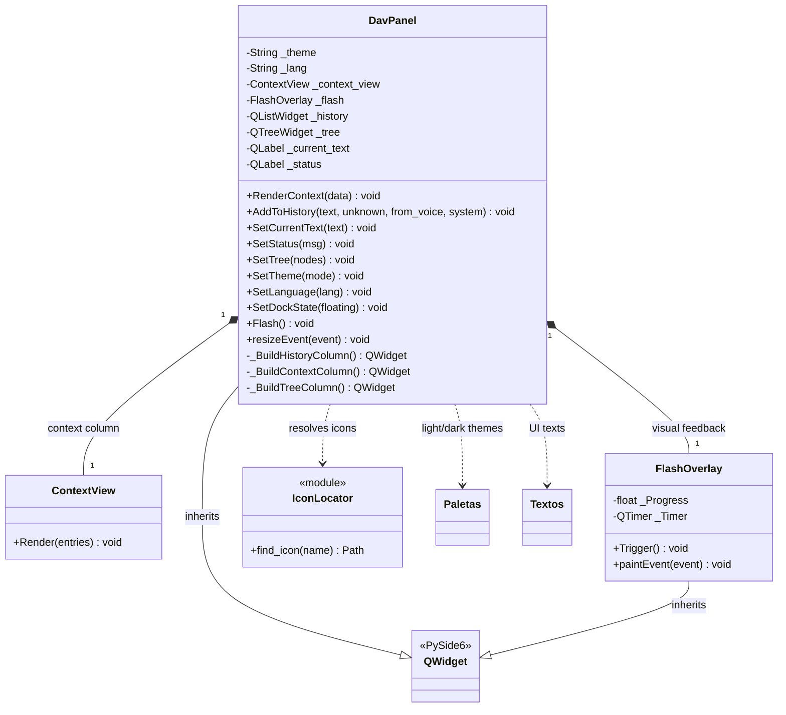
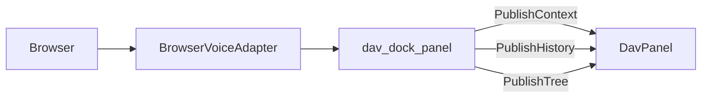

# DavPanel

> **File:** `Dav/scr/ComponentesDAV/InterfazDAV/DavPanel.py`

The DAV GUI: a widget that lives inside FreeCAD as a `QDockWidget`. It shows
the navigation context, the command history and the document's object
tree.

It replaced `MainWindow.py` (1011 lines, external process) in the migration
documented in [`gui-unification-plan.md`](../gui-unification-plan.md).

## How it is fed

The panel **does not import FreeCAD or the `Browser`**: it receives data and emits signals.
What connects it is `integration/dav_dock_panel.py`.

That separation is deliberate: it makes it possible to test the widget without starting FreeCAD.

## Design notes

- **Everything that enters the panel has to come from the GUI thread.** Touching a Qt
  widget from the microphone thread is an access violation. `BrowserVoiceAdapter`
  checks with `_on_gui_thread()` before publishing.
- Hiding/showing is provided by the `QDockWidget` that contains it, not by the panel: this
  covers the MVP's "minimize" requirement.
- The object tree is built from `App.ActiveDocument` with a
  `DocumentObserver`, with no macro or polling.
