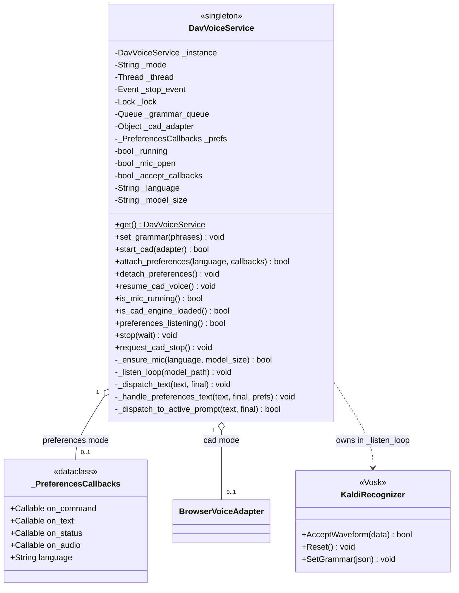
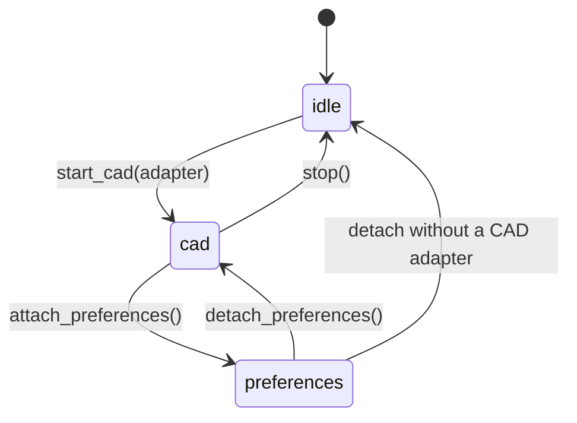

# DavVoiceService

> **File:** `Dav/scr/ComponentesDAV/IntegracionGUI/GUIFreeCad/speech/dav_voice_service.py`

Singleton that owns the microphone and the Vosk recognizer. A single audio thread
for all of DAV: it is shared by CAD navigation and the Preferences dialog, which
used to compete for the device.

## The two modes

| Mode | Who consumes | Grammar |
| --- | --- | --- |
| `cad` | `BrowserVoiceAdapter` | Active navigation context |
| `preferences` | Preferences dialog | 81 configuration phrases |
| `idle` | Nobody | Microphone closed |

## The audio thread

`_listen_loop` runs on a separate thread (`DAV-VoiceService`) so as not to block
FreeCAD's UI. On each iteration:

1. It drains `_grammar_queue` and keeps only the latest grammar
2. If it changed: `Reset()` + `SetGrammar()` — **always on this thread**, never from
   the GUI
3. `AcceptWaveform()` and dispatches the text according to the mode

Details on why `Reset()` is mandatory (Vosk aborts the process without it):
[`vosk-grammar-shortener.md`](../vosk-grammar-shortener.md).

## Design notes

- **`_ensure_mic` restarts the thread if the language or the model size changed**,
  because the model is loaded only once, when the recognizer is created.
- Thread failures are recorded in `config/dav.log`: if the log stops without the line
  `hilo de voz terminado` (voice thread finished), the process died inside the loop.
- `_dispatch_to_active_prompt` gives priority to open `InputPrompts` over
  normal navigation.
