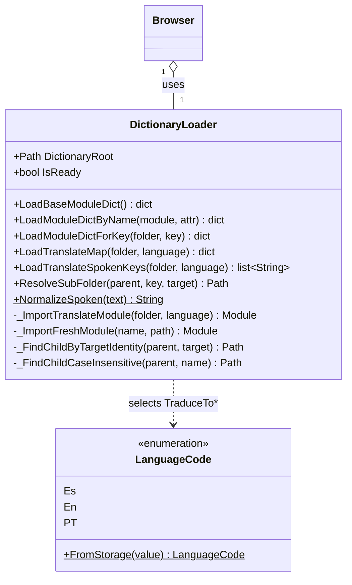

# DictionaryLoader

> **File:** `Dav/scr/ComponentesDAV/IntegracionGUI/GUIFreeCad/navigation/dictionary_loader.py`

Loads the modules of `Dav/dic/` from disk: the base dictionary, the per-language
translations and the submenus. It isolates the `Browser` from the file system and from
import details.



## Which files it looks for

```
Dav/dic/
├── base.py                 → LoadBaseModuleDict()
├── TraduceToEs.py          → LoadTranslateMap(root, Es)
├── NavCommands/
│   ├── NavActions.py       → LoadModuleDictByName("NavCommands.NavActions", "NavActions")
│   └── TraduceToEs.py      → LoadTranslateMap(NavCommands, Es)
└── explorer/
    ├── explorer.py         → base dictionary of the folder
    └── TraduceToEs.py      → LoadTranslateMap(explorer, Es)
```

One folder = one context level. Each has its base dictionary (internal
keys → FreeCAD callables) and its per-language translations (spoken phrases →
the same callables).

## Design notes

- **It tolerates a missing dictionary.** If the folder is missing or a module fails
  to import, it returns empty and leaves a message: the engine starts with empty
  contexts instead of breaking FreeCAD's startup.
- **`ResolveSubFolder` matches by the identity of the `Target`**, not by folder
  name: the name may differ from the internal key.
- `_ImportFreshModule` forces a reload so that a change in a dictionary is
  seen without restarting FreeCAD.
- Accent normalization lives here (`NormalizeSpoken`) and must be the same one
  used by `ContextEntry`.
