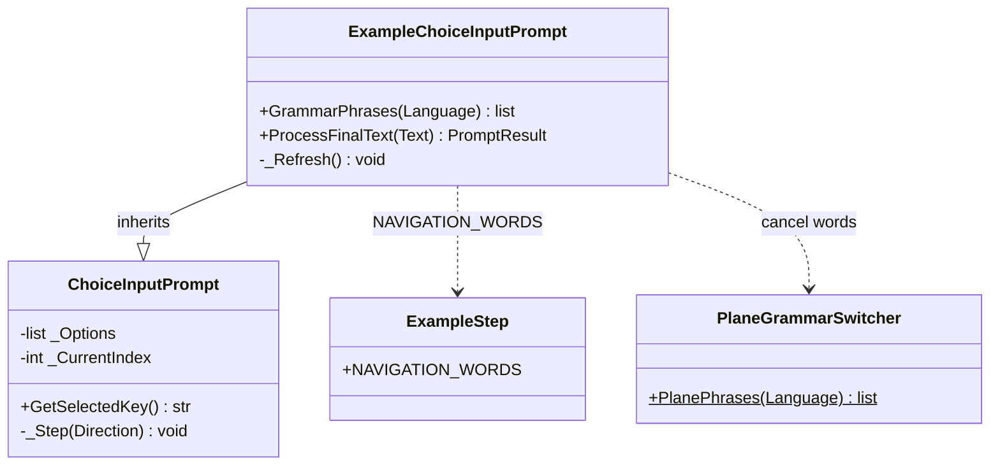

# ExampleChoiceInputPrompt

> **File:** `Dav/scr/ComponentesDAV/IntegracionGUI/GUIFreeCad/InputPrompts/ExampleChoiceInputPrompt.py`

Example selector. It inherits from [`ChoiceInputPrompt`](ChoiceInputPrompt.md) but
changes the vocabulary: **`retroceder`** (back) and **`avanzar`** (forward) move the selection (wrapping
around) and **`enviar`** (send) chooses. `cancelar` (cancel) aborts. It returns the key of the
chosen example.

## What changes compared to the base class

| Method | Difference |
| --- | --- |
| `GrammarPhrases(Language)` | Only back, forward, send and cancel: it does not include option names |
| `ProcessFinalText(Text)` | An option is not chosen by naming it: you only navigate and send |
| `_Refresh()` | The status shows `(n/total)` and the navigation words of the active language |

## Design notes

- **It reuses `_Step` and `GetSelectedKey`** from the base class; it only replaces the vocabulary.
- **It accepts the words of all three languages**, as `FileSelectionInputPrompt` does,
  but the Vosk grammar is narrowed to the active language.
- It is opened by `startExample()` in [`Examples`](Examples.md).
