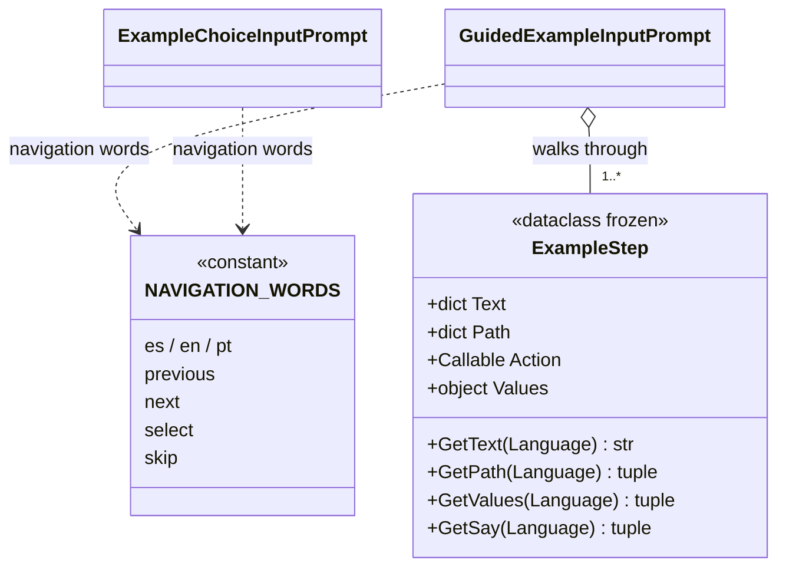

# ExampleStep

> **File:** `Dav/scr/ComponentesDAV/IntegracionGUI/GUIFreeCad/InputPrompts/ExampleStep.py`

One **frame** of a guided example: what is shown to the user, **what they would say to
do the same thing in DAV**, and what is executed in FreeCAD when they have said it all. It is an
immutable `dataclass`. The same file defines `NAVIGATION_WORDS`, the words
*retroceder / avanzar / enviar / saltar* (back / forward / send / skip) in the three languages, shared by the
selector and the player.

## What the user says: `Path` and `Values`

What has to be said in a frame is the same thing that would be said to do it without an example. It is
split into two parts that are said **in this order**:

| Field | What it is | Example (es) |
| --- | --- | --- |
| `Path` | The phrases that **navigate the command tree** until reaching the command. Each element is a phrase from the dictionary (`"nuevo boceto"`, `"tres de"`) | `("banco", "croquis", "nuevo")` |
| `Values` | What is **dictated in the dialogs** that the command opens: numbers, `enviar`, `abajo` to move through a list | `("cero", "enviar", "cero", "enviar", "doce", "enviar")` |

`GetSay(Language)` returns `Path + Values`: it is what the player shows and expects.

`Values` can be a per-language `dict` or a **function** `f(language) -> tuple` when
what is dictated depends on the document. It is evaluated every time the frame is shown, with the
document as it is at that moment. Example: in the Dice example, how many times to say `abajo` (down)
to reach a face in the selector's list.

## Fields

| Field | What it is |
| --- | --- |
| `Text` | Instruction that is shown, per language (`es`, `en`, `pt`) |
| `Path` | Navigation phrases, in order, per language |
| `Action` | Argument-less function that does the work in FreeCAD |
| `Values` | Words dictated in the command's dialogs (optional) |

## Design notes

- **It falls back to Spanish.** `GetText`, `GetPath` and `GetValues` return the Spanish version if
  the requested language is missing.
- **The data does not know about voice.** The frame only declares what is said and what is executed; who
  listens to it and compares it is [`GuidedExampleInputPrompt`](GuidedExampleInputPrompt.md).
- **`Path` can be checked against the real tree** without executing anything: that is done by
  `tests/verify_examples_paths.py` (see [`Examples`](Examples.md)). `Values` cannot, because it
  depends on each command's dialogs.
- **The real command and the action are not the same thing.** What is said is the real thing; the `Action` calls
  FreeCAD directly (or the same measuring function the dictionary uses), so an example
  does not open modal dialogs or depend on the user's selection.
