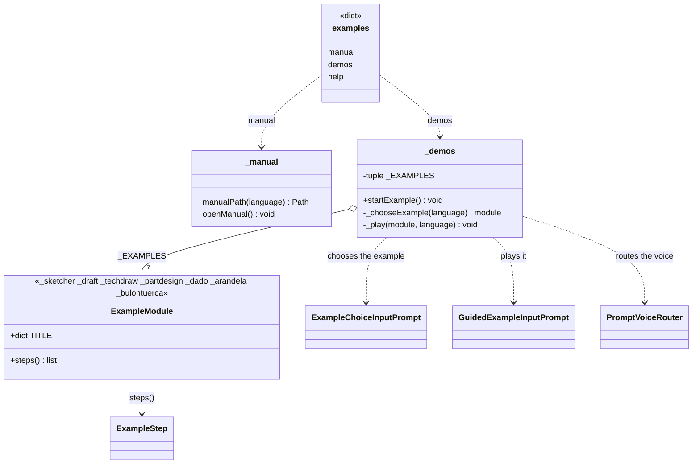

# Examples (`Explorer/Examples` folder)

> **Folder:** `Dav/dic/Explorer/Examples/`

Explorer submenu for learning: it opens the user manual and launches guided
examples. You enter it by saying *ejemplos*, *quiero aprender* or *aprender* (and their
English and Portuguese equivalents). The folder has no icon; its two leaves do
(`manual.svg` and `demos.svg`).



## Submenu leaves

| Key | Words (es) | What it does |
| --- | --- | --- |
| `manual` | manual, referencia, guía | `openManual()`: opens `Manual_Usuario.pdf` (Spanish), `User_Manual.pdf` (English) or `Manual_do_Usuario.pdf` (Portuguese) |
| `demos` | ejemplos, demostraciones, tutorial | `startExample()`: example selector and player |
| `help` | ayuda | The submenu's help window |

## Examples

| Module | Content | Dimensions | Frames |
| --- | --- | --- | --- |
| `_sketcher` | A circle with a radius constraint | 2D dimension | 5 |
| `_draft` | Rectangle, circle and polygon | 2D dimension | 4 |
| `_techdraw` | A circle on an A4 sheet with a title block | — | 4 |
| `_partdesign` | A screw: cylinder, cone, prism, chamfer and a thread with a helix | 3D dimension and "tres de" (three-D) | 9 |
| `_dado` | A die: the 1 with a cylinder, 2 to 6 with a sketch and a pocket per face | 3D dimension, six views and "tres de" | 25 |
| `_arandela` | An M6 flat washer: two circles in a sketch, a 1.6 mm extrusion and a TechDraw sheet with an isometric view, a view of the sketch and text | Diameter constraint and 2D dimension | 11 |
| `_bulontuerca` | An M6 bolt (simplified from DIN 931) and its nut in PartDesign, and an assembly: links inserted by voice, anchored bolt and cylindrical joint on the chosen faces | Assembly and "tres de" | 11 |

Each module exposes `TITLE` (per language) and `steps()`, which returns the list of
[`ExampleStep`](ExampleStep.md). To add an example it is enough to create the module
and add it to `_EXAMPLES` in `_demos.py`.

Support files: `_common.py` (active document, fitting the view, standard views, locating a
primitive) and `_words.py` (the numbers and words dictated in the dialogs, in the three
languages: `numbers`, `send`, `down`, `nextItem`, `no`, `yes`). `numbers` dictates any value, integer or decimal: 0 to 99 with the natural word, 100 onwards digit by digit, and the decimal with "punto" (point) (in Spanish the player also accepts "coma" (comma), see `WORD_SYNONYMS` in `ExampleStep.py`).

## What is said is the real thing

The frames do not invent phrases: each `Path` is what a user would say, walking through the tree, to
do exactly that. The case of a sketch's circle:

```
banco → croquis → nuevo → enviar        (chooses the plane)
geometría → círculo → círculo           (creates the circle)
cero enviar · cero enviar · doce enviar  (center X, center Y, radius)
```

(Spanish voice phrases: "bench → sketch → new → send", "geometry → circle → circle", "zero send · zero send · twelve send".)

The dialogs are played back just as each command asks for them; each value with its `enviar`. When
what is dictated depends on the document (the Dice example), `Values` is a function; see [`ExampleStep`](ExampleStep.md).

## Verification against the real tree

`tests/verify_examples_paths.py` (launched with `freecadcmd`) replays each `Path`, in the three
languages, through a real `Browser`, executes the actions and writes a report with the command that
each frame reaches. It serves to detect that:

- a phrase does not resolve (a word missing from a `TraduceTo*`);
- a phrase reaches **another command** by approximate matching (for example "cortar" (cut) said from
  *Sumar* (add) used to reach "cotar" (dimension)); this is avoided with "subir" (up) beforehand;
- the context changes along the way (from *Círculo*, "crear" (create) jumps to Workbench; that is why the
  Draft polygon starts with "subir").

For the Dice, after "cerrar croquis" (close sketch) it goes back to "banco" and "diseño", because closing leaves the voice
in *Croquis* (Sketch) even if the sketch belongs to a Body.

## Design notes

- **The keys do not clash with the folder's icon.** The panel looks up the SVG by the
  key's name, which is why the examples leaf is called `demos` and not `examples`:
  that way the `examples` folder stays without an icon.
- **Manual per language.** Portuguese opens the English manual because there is no Portuguese
  one. The PDF is searched for by walking up from the file to the root of the repo or
  of the installation.
- **Examples use the FreeCAD API.** What is **said** is the real thing, but each `Action` calls
  FreeCAD directly (or the dictionary's own dimension function) and does not go through the command's
  modal dialogs; that way the example works even if the user is in another context and does not
  depend on a prior selection.
- **One example at a time:** `_player` holds the active player.
