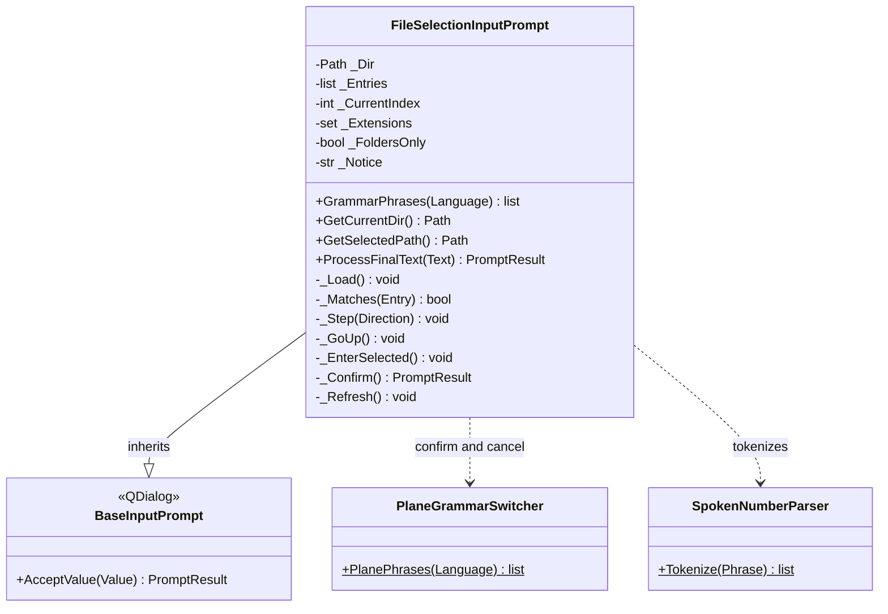

# FileSelectionInputPrompt

> **File:** `Dav/scr/ComponentesDAV/IntegracionGUI/GUIFreeCad/InputPrompts/FileSelectionInputPrompt.py`

Voice folder browser. File names **cannot be dictated** (they are not
in Vosk's vocabulary), so you walk through the list with
*siguiente / anterior* (next / previous), enter a folder with *abrir* (open), go up with *subir* (up) and
confirm with *okey*. It is used by the Project submenu (open, save and export without
FreeCAD's native dialogs).

## Words

| Role | es | en | pt |
| --- | --- | --- | --- |
| Next | siguiente, avanzar, abajo, próximo, otro | next, forward, down, advance | seguinte, próximo, abaixo |
| Previous | anterior, atrás, retroceder, arriba, previo | previous, back, up | anterior, voltar, cima |
| Go up | subir, padre | parent, out | subir, pai |
| Enter | abrir, adentro | open, inside | abrir, dentro |
| Choose | elegir, seleccionar | choose, select | escolher, selecionar |

`entrar` does **not** work for going into a folder because it is already a
confirmation word.

## Modes

| Mode | List | `okey` |
| --- | --- | --- |
| Files (default) | Folders and then files, filtered by `Extensions` | On a file it chooses it; on a folder it **enters** |
| Folders only (`FoldersOnly=True`) | Folders only | Chooses the folder currently being viewed, so a folder with no subfolders can also be chosen |

The accepted value is the chosen path, as text.

## Design notes

- Folders come before files and each group is sorted case-insensitively
  (`casefold`). Entries that start with a dot are hidden.
- If the folder cannot be read, the error is shown as a notice and the list stays empty.
- Whoever opens it must narrow the grammar with `GrammarPhrases` and register it in
  [`PromptVoiceRouter`](PromptVoiceRouter.md); see `_browse` in `Explorer/Proyecto/_project.py`.
