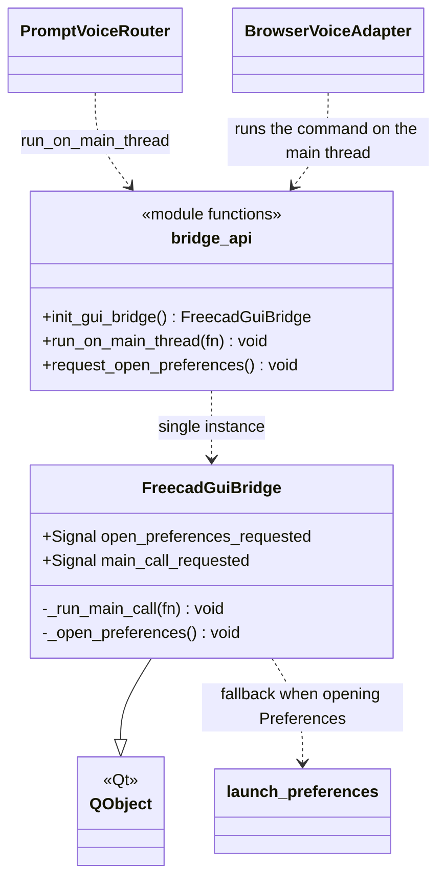
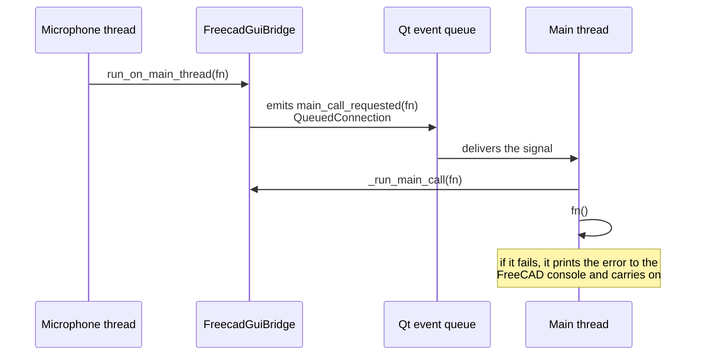

# FreecadGuiBridge

> **File:** `Dav/scr/ComponentesDAV/IntegracionGUI/GUIFreeCad/integration/freecad_gui_bridge.py`

Bridge **from the microphone thread to Qt's main thread**. FreeCAD commands
(`Gui.runCommand`, creating objects, opening dialogs) can only be executed from the
interface thread, but speech is recognized on another one. The bridge receives a function
from any thread and queues it so that it runs on the main one.

## How it works

## Responsibilities

| Element | What it does |
| --- | --- |
| `run_on_main_thread(fn)` | Queues `fn` on the main thread. It is safe to call from any thread |
| `request_open_preferences()` | Requests opening DAV's Preferences from the voice thread |
| `init_gui_bridge()` | Creates the bridge the first time and always returns the same one |
| `_run_main_call(fn)` | Runs the function; an error is reported but **does not bring down the interface thread** |
| `_open_preferences()` | Tries `Gui.runCommand("DAV_OpenPreferences")`; if that fails it uses [`launch_preferences`](LaunchPreferences.md) |

## Design notes

- **`QueuedConnection` is what switches threads.** With a direct connection the function
  would run on the emitting thread, not on Qt's.
- **Lazy single instance:** the `QObject` must be created on the main thread; that is why
  `init_gui_bridge()` is called when preparing the voice (`freecad_voice_setup.py`) and not from the voice thread.
- If `run_on_main_thread` is not available (outside FreeCAD), `PromptVoiceRouter` runs
  the function directly.
