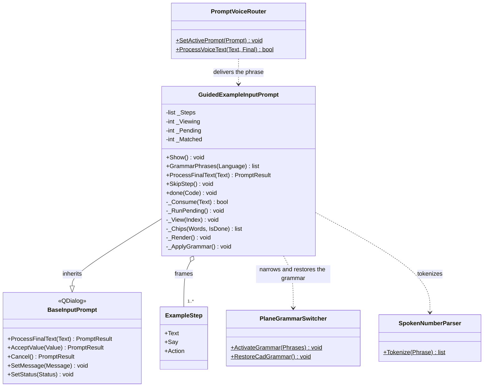
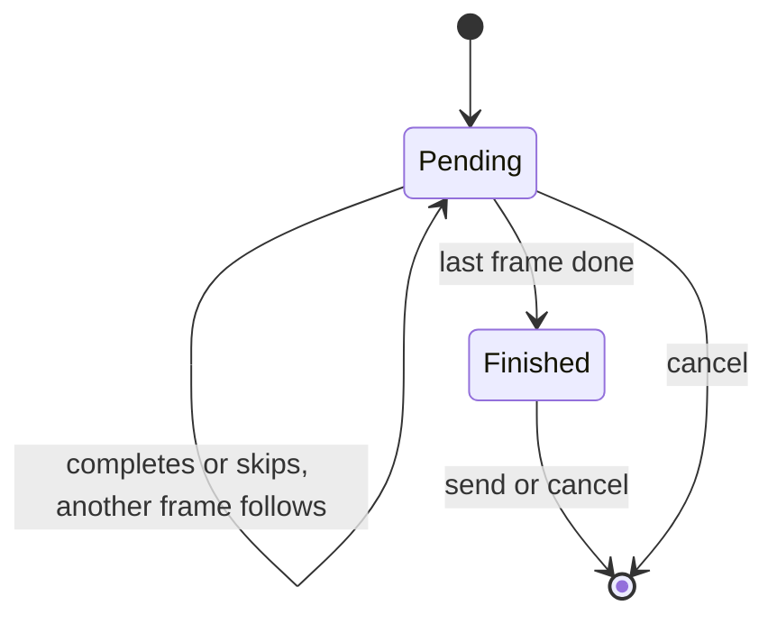

# GuidedExampleInputPrompt

> **File:** `Dav/scr/ComponentesDAV/IntegracionGUI/GUIFreeCad/InputPrompts/GuidedExampleInputPrompt.py`

Guided example player. It shows **one frame at a time** with the words
the user must say; when they have said them all, in order, it runs the frame's action
and moves on to the next. Unlike the rest of the prompts it is **non-modal**:
the user sees how the part is built in the 3D view while following the example.

## Responsibilities

| Method | What it does |
| --- | --- |
| `ProcessFinalText(Text)` | First it compares the words of the pending frame; if they do not match, cancel closes, *saltar* (skip) executes and *retroceder*/*avanzar* (back/forward) review frames; when finished, *enviar* (send) closes |
| `_Consume(Text)` | Looks in the phrase for the pending words **in order**; keeps progress between phrases; when they are complete it calls `_RunPending` |
| `_RunPending()` | Runs `Action`; if it fails, the frame does not advance and the error is shown |
| `SkipStep()` | Runs the frame without saying its words (it is also the window's button) |
| `GrammarPhrases(Language)` | Navigation, cancel and the words of the **current frame** |
| `Show()` | Shows the window at the bottom right of the editor, without blocking it |
| `done(Code)` | Restores the CAD grammar when closed |

## State

- `_Pending`: first frame not yet done. `_Viewing`: the one being viewed. You can only
  go back to earlier frames (`_Viewing ≤ _Pending`), never skip one ahead.
- `_Matched`: words already said of the pending frame.

## Design notes

- **Words accumulate across phrases** within the same frame, but a
  word out of order does not count. They can be said all together or one at a time, as in real use.
- **The frame's words take precedence over cancel.** A frame may ask for "no" (the answer to
  "new body?"), which at any other time cancels.
- **Repetitions are grouped when displayed**: `abajo abajo abajo` shows as "abajo ×3", with
  the progress ("2/3") while they are being said.
- **The grammar is narrowed per frame:** Vosk only listens for the words of the current
  frame and navigation, which improves recognition.
- **Non-modal:** that is why `startExample()` keeps the player's reference and
  registers the router's cleanup on `finished`.
- The base prompt's *Accept* button becomes *Skip frame* and *Cancel* becomes *Close*.
