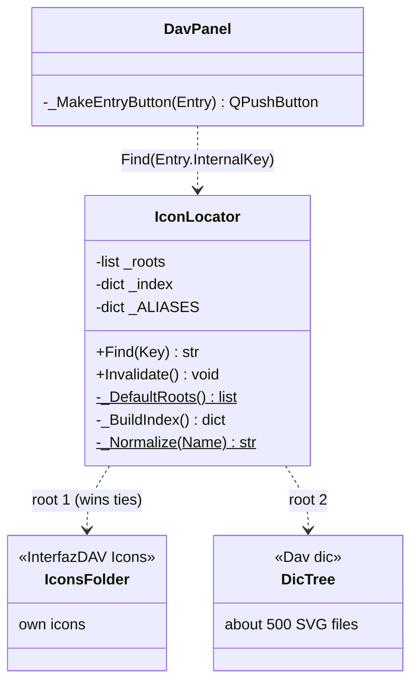
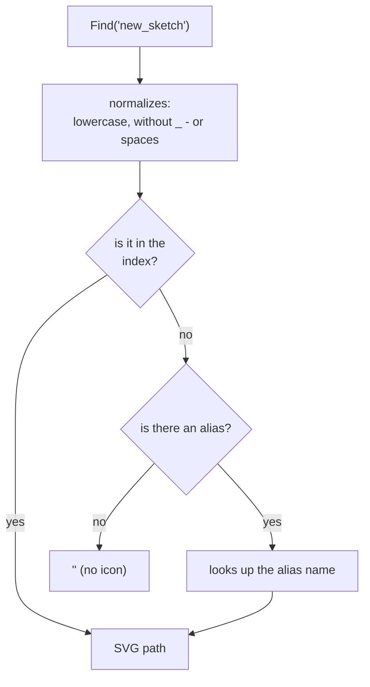

# IconLocator

> **File:** `Dav/scr/ComponentesDAV/InterfazDAV/IconLocator.py`

Finds the **SVG for a dictionary key** so that [`DavPanel`](DavPanel.md)
can draw each button's icon. It indexes the icon folders **only once** (on the
first request) and reuses the index. Previously the whole tree was walked for every button
and on every repaint, with no cache.

## How it searches

## Rules to know when adding an SVG

| Rule | Consequence |
| --- | --- |
| **It is looked up by the key's name**, not by the folder | For a button to have an icon, the SVG is named after its key: key `save` → `save.svg` |
| **The name is normalized** | `lineattributes` = `LineAttributes.svg`; `new_sketch` = `NewSketch.svg` |
| **The first root that defines a name wins** | An icon in `InterfazDAV/Icons` overrides the one in the dictionary tree |
| **A repeated name in the tree: the first one found wins** | Two folders with `open.svg` share an icon: `setdefault` does not tell folders apart |
| **No SVG is not an error** | `Find` returns `""` and the panel uses its two-letter fallback |
| **`_ALIASES`** | Keys whose icon exists under another name: `pieza`→`part`, `circulo`→`circle`, `stdview`→`standardviews` |

## Design notes

- **A folder without an icon is valid and sometimes desired**: that is why the examples leaf
  is called `demos` and not `examples`; that way the `examples` folder has no SVG.
  See [`Examples`](Examples.md).
- **The `Dav/dic` root is validated** by looking for `base.py` (`ComponentesDAV/Dav/dic` is an
  empty placeholder that appears earlier in the ancestor chain).
- `Invalidate()` discards the index; the next `Find` walks the folders again.
